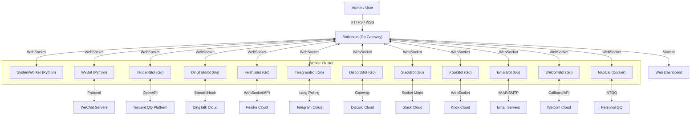

# BotMatrix 🌌

**The Next-Generation Enterprise Bot Management System**
**新一代企业级 OneBot 机器人集群管理系统**

[](https://go.dev/)
[](https://www.python.org/)
[](Dockerfile)
[](LICENSE)

---

## 📢 Recent Updates | 最近更新

### [v1.6.0] - 2025-12-25
- **3D Visualization Overhaul**: Implemented enhanced node labels, fixed sprite orientations, and introduced a dynamic blue-themed link system with transmission-based brightness pulses.
- **Full-Path Routing**: Visualized end-to-end message routing (User -> Group -> Nexus -> Worker) in real-time within the 3D space.
- **Smart Cache Enrichment**: Automated metadata caching for group/user names in BotNexus, enriching messages before they reach workers to minimize external API calls.
- **Intelligent Auto-Reply**: Added a global auto-reply engine that provides automated maintenance notifications when the system gateway is closed.
- **Settings Persistence**: Resolved critical bugs in system settings synchronization, ensuring LogLevel and AutoReply preferences are correctly saved.

### [v1.5.0] - 2025-12-24
- **PostgreSQL-First Architecture**: Completely removed legacy SQLite support to focus on enterprise-grade performance and scalability with PostgreSQL.
- **Dependency Optimization**: Stripped out unused database drivers and legacy dependencies, resulting in a cleaner and more maintainable core codebase.
- **Modernized Config UI**: Re-engineered the Admin Web UI configuration grid to provide direct, real-time management of PostgreSQL, Redis, and core system parameters.
- **Improved Type Safety**: Resolved API data type mismatches for configuration fields, ensuring robust communication between the Vue.js frontend and Go backend.

### [v1.4.0] - 2025-12-24
- **Web UI Standardization**: Standardized the administrative Web UI across all major BotMatrix components (FeishuBot, KookBot, SlackBot, TelegramBot, EmailBot, etc.) with a consistent tabbed interface.
- **Enhanced Log Management**: Integrated real-time log streaming with 2000ms auto-refresh and log rotation management into each bot's local admin panel.
- **Secure Configuration**: Sensitive credentials (Tokens, Keys) are now masked with password fields in the Web UI to prevent accidental exposure.
- **Bot Lifecycle Management**: Implemented graceful restart and shutdown logic using Go's `context` and `sync` packages across all bot workers.
- **Chinese Localization**: Full Chinese language support for all administrative interfaces, improving usability for regional users.

### [v1.3.2] - 2025-12-22
- **BotWorker Stateless Sessions**: Added Redis/DB-backed confirmation and dialog state so multiple workers can safely handle the same group without losing context.
- **Dangerous Action Protection**: Introduced 3-digit numeric confirmation codes for operations like clearing blacklists/whitelists, reducing mis-operations by admins.
- **Voice Reply & Burn-After-Reading**: Exposed per-group switches for AI voice replies and auto-recall (阅后即焚) via the Admin plugin.
- **Documentation Refresh**: Updated BotWorker docs and development notes to reflect the new confirmation, dialog, and session designs.

### [v1.3.1] - 2025-12-22
- **New BotWorker Features**: Added Pet System and advanced Command Parser plugins.
- **Enhanced Testing**: Introduced comprehensive test plans and CLI tools for developers.
- **Repository Consolidation**: Fully integrated BotWorker source into the main repository.

### [v1.3.0] - 2025-12-22
- **Major Architectural Decoupling**: Separated Core Gateway (`BotNexus`) from Management Backend (`BotAdmin`).
- **Core Optimization**: Leaner, faster message routing engine with removed redundant dependencies.
- **Code Standardization**: Full PascalCase enforcement and logic consolidation in `Common` library.

For a detailed history of all changes and versions, please refer to the [CHANGELOG.md](CHANGELOG.md) file.

详细的更新历史和版本说明请参阅 [CHANGELOG.md](CHANGELOG.md) 文件。

---

## 🚀 Getting Started | 快速开始

### Prerequisites | 环境要求
*   **Go**: 1.19+ (For BotNexus & Go-based Workers)
*   **Python**: 3.9+ (For SystemWorker & WxBot)
*   **Docker & Docker Compose**: Recommended for production deployment
*   **Flutter**: For building Overmind mobile/web dashboard (Optional)

### Installation | 安装步骤

1.  **Clone the Repository**
    ```bash
    git clone https://github.com/changliaotong/BotMatrix.git
    cd BotMatrix
    ```

2.  **Configuration**
    *   Copy `.env.example` to `.env` and configure your environment variables.
    *   For each bot component (e.g., `WxBot`, `TencentBot`), copy `config.sample.json` to `config.json` in its respective directory.

3.  **Run with Docker Compose (Recommended)**
    ```bash
    docker-compose up -d
    ```

4.  **Access the Dashboard**
    *   Open your browser and navigate to `http://localhost:8080` (or your configured port).
    *   The Overmind dashboard is also available via `/overmind/` route.

---

## 📂 Project Structure | 项目结构

| Directory | Description | Language |
| :--- | :--- | :--- |
| `src/BotNexus/` | High-performance WebSocket Gateway & Proxy | Go |
| `src/BotAdmin/` | Management API & Dashboard Server | Go |
| `src/BotWorker/` | Plugin-based Message Processing Worker | Go |
| `src/Overmind/` | Cross-platform Management Dashboard (Mobile/Web) | Flutter |
| `src/SystemWorker/` | System Monitoring & Remote Execution | Python |
| `src/TencentBot/` | Official QQ Guild/Group Support | Go |
| `src/DingTalkBot/` | Enterprise DingTalk Integration | Go |
| `src/FeishuBot/` | Modern Feishu/Lark Integration | Go |
| `src/Common/` | Shared Core Libraries & Types | Go |
| `docs/` | Detailed Technical Documentation | Markdown |

---

## 🛠 Deployment | 部署指南

We provide a unified deployment script `deploy.py` for simplified lifecycle management:

```bash
# Bump version and pack project
python deploy.py --target all --mode full

# Fast update (restart containers without rebuild)
python deploy.py --target nexus --mode fast
```

Detailed deployment guides can be found in [docs/DEPLOY.md](docs/DEPLOY.md).

---

## 🤝 Contributing | 贡献指南

Contributions are welcome! Please feel free to submit a Pull Request. For major changes, please open an issue first to discuss what you would like to change.

---

## 📜 License | 开源协议

This project is licensed under the **MIT License** - see the [LICENSE](LICENSE) file for details.

---

## 📖 Introduction | 简介

**BotMatrix** is a high-performance, distributed robot management platform designed for enterprise scale. It decouples the connection layer from the logic layer, allowing for massive scalability and robust management.

*   **BotNexus (The Core)**: A high-concurrency Gateway written in **Go**. It provides a unified WebSocket interface for bots and workers, handling message routing and load balancing.
*   **BotAdmin (The Brain)**: The management backend that provides REST APIs, JWT authentication, and serves the **Real-time Dashboard**.
*   **Overmind (The Eye)**: A cross-platform dashboard built with Flutter, allowing you to manage your bot fleet from anywhere.
*   **SystemWorker (The Brain)**: A system-level **Python** worker. It handles global commands, visualizes status, and executes remote code.
*   **WxBot (The Bot)**: A flexible Bot Node written in **Python**. It handles protocol adaptation (WeChat/OneBot) and executes business logic.
*   **WeComBot (Enterprise)**: A **Go-based** implementation for WeChat Work (WeCom), supporting internal app integration via callbacks.
*   **NapCat (Personal)**: A **Containerized** implementation for Personal QQ, utilizing NTQQ and OneBot 11.
*   **TencentBot (The Official Worker)**: A high-performance Worker written in **Go**, utilizing the official Tencent Bot SDK (`botgo`) for stable, compliant QQ Guild and Group operations.
*   **DingTalkBot (The Enterprise Worker)**: A **Go-based** implementation supporting DingTalk's Webhook and Stream Mode for enterprise internal integration.
*   **FeishuBot (The Modern Worker)**: A **Go-based** implementation for Feishu/Lark, utilizing official WebSocket SDK for secure, firewall-friendly enterprise operations.
*   **TelegramBot (International)**: A **Go-based** implementation for Telegram, connecting via Long Polling.
*   **DiscordBot (Community)**: A **Go-based** implementation for Discord, supporting channel messages and DMs.
*   **SlackBot (Enterprise)**: A **Go-based** implementation for Slack, utilizing Socket Mode for enterprise integration.
*   **KookBot (Community)**: A **Go-based** implementation for Kook (Kaiheila), utilizing WebSocket for real-time interaction.
*   **EmailBot (Utility)**: A **Go-based** implementation for Email (IMAP/SMTP), bridging emails to OneBot messages.

---

## ✨ Key Features | 核心功能

### 📊 Real-Time Visual Analytics (实时可视化分析)
> Experience the heartbeat of your bot cluster.
*   **Dynamic Charts**: Live visualization of **CPU Usage**, **Memory Trends**, and **Message Throughput (QPS)**.
*   **System Health**: Monitor Goroutines, GC cycles, and server uptime in real-time.
*   **Process Monitor**: Top 10 high-resource processes table to keep server performance in check.

### 🤖 Advanced Bot Fleet Management (集群管理)
*   **Unified List**: View all connected bots with details like **IP Address**, **Connection Duration**, and **Owner**.
*   **Status Tracking**: Instant visibility into bot health and connectivity.
*   **Remote Control**: Manage specific bots directly from the dashboard.

### 👥 User & Group Insights (用户与群组洞察)
*   **Activity Ranking**: "Top 5 Active Groups" and "Top 5 Active Users" (Dragon King) leaderboards.
*   **Member Management**: Search, ban, kick, or modify card names for group members via a unified UI.

### 🔒 Enterprise Security (企业级安全)
*   **Role-Based Access**: Granular permissions for **Admins** and standard **Users**.
*   **Multi-User Auth**: Secure login system with token-based authentication.

### 🔥 Burn After Reading (阅后即焚)
> *Privacy First, Trace Free.*
*   **Secure & Ephemeral**: Auto-recall messages after a configurable delay (0-120s).
*   **High-End Privacy**: Ensure sensitive info vanishes without a trace.
*   **Universal Control**: Seamlessly integrated into the dashboard for supported bots.

### 📜 Centralized Log Management (集中式日志管理)
> *See it all in one place.*
*   **Unified View**: Monitor console logs from all connected bots directly in the dashboard.
*   **Smart Display**: Auto-truncates long logs with click-to-expand; auto-pauses refresh on interaction.
*   **Real-Time Streaming**: Logs are streamed via WebSocket with practically zero latency.
*   **Per-Bot Filtering**: Easily switch between viewing system logs or specific bot logs.

### 🐳 Docker Container Management (容器管理)
> *Control your infrastructure.*
*   **Visual Management**: View and manage Docker containers directly from the sidebar.
*   **Status at a Glance**: Check container ID, names, image, and running status instantly.
*   **One-Click Refresh**: Keep track of container changes in real-time.

### 🧠 Overmind Integration (Overmind 集成)
> *Next-level control.*
*   **Seamless Access**: One-click navigation to the Overmind frontend directly from the sidebar.
*   **Unified Workflow**: Manage your bot cluster and Overmind system without switching contexts.

### 🧠 Intelligent Robot Collaboration (机器人智能协作)
> *One Click, Full Linkage.*
*   **Smart Wake-Up**: Bypasses Tencent Guild Bot restrictions (passive reply only) by coordinating with ordinary bots to "wake up" guild bots via @mentions.
*   **Cross-Protocol Synergy**: Bridges the gap between different bot platforms (e.g., QQ Guild ↔ QQ Group).
*   **Unstoppable Workflow**: Ensures critical messages are delivered even under strict platform limitations. [Read More](docs/QQ_GUILD_SMART_SEND_CN.md).

### 🎯 Intelligent Message Routing (智能消息路由)
> *Smart Load Balancing & Fixed Routing.*
*   **Dual Routing Modes**: 
  *   **API Requests**: External requests use round-robin load balancing for optimal worker distribution
  *   **Message Events**: Bot messages apply intelligent routing rules for targeted worker selection
*   **Priority Routing**: Messages first check routing rules (group_id/bot_id → worker_id) before falling back to random selection
*   **Enterprise Use Cases**: 
  *   **VIP Users**: Route high-priority users to dedicated high-performance workers
  *   **Testing Environment**: Direct test messages to specific workers for debugging
  *   **Load Distribution**: Balance workload across workers based on business requirements
*   **Admin Management**: REST API (`/api/admin/routing`) for dynamic routing rule configuration
*   **Failure Recovery**: Automatic fallback to round-robin if designated worker is unavailable
*   **Real-time Validation**: Built-in test tools for routing rule functionality verification

### 🎟️ Auction System (竞拍系统)
> *Bid for physical/virtual items and group sponsorship rights.*
*   **Multi-type Auctions**: Support for physical items, virtual items, and group sponsorship auctions
*   **Group Sponsorship**: Auction for group name rights with 1-7 days advance booking
*   **Auto-bidding**: Set maximum bid and increment for automatic bidding when outbid
*   **Time-based Rules**: 
    *   Group sponsorship auctions end at 21:00 on the effective date
    *   Automatic顺延 if current time passes 21:00
    *   Support for bidding 1-7 days in advance
*   **Commands**:
    *   `/创建竞拍 <名称> <起拍价> <时长> <描述>` - Create a new auction
    *   `/竞拍群冠名 <起拍价> <天数> <描述>` - Create group sponsorship auction
    *   `/出价 <竞拍ID> <价格>` - Place a bid on an auction
    *   `/setautobid <竞拍ID> <最高出价> <加价幅度>` - Set up auto-bidding
    *   `/cancelautobid <竞拍ID>` - Cancel auto-bidding
    *   `/showmyautobids` - Show all auto-bid settings
*   **Integration**: Built-in integration with Points Plugin for payment processing

### 🏅 Medal System (勋章系统)
> *Award and manage achievement badges for users.*
*   **Multi-type Medals**: Support for honor, achievement, and rank medals
*   **Medal Levels**: Progressive medal levels with upgrade progress tracking
*   **Automatic Granting**: System-triggered medal awarding based on user activities
*   **Manual Management**: Admin tools for manual medal granting and revocation
*   **Medal Showcase**: Users can view their earned medals and progress
*   **Commands**:
    *   `/我的勋章` - Show all medals owned by the user
    *   `/查看勋章 <勋章名称>` - Get detailed information about a specific medal
    *   `/勋章列表` - Display all available medals in the system
    *   `/发放勋章 <用户ID> <勋章名称>` - Admin command to grant medals
    *   `/回收勋章 <用户ID> <勋章名称>` - Admin command to revoke medals
*   **Data Persistence**: Complete medal ownership and grant history tracking

---

## 🛠 Architecture | 架构



## 📂 Project Structure | 项目结构

```text
BotMatrix/
├── BotNexus/            # [Go] The Brain (Gateway & Dashboard)
│   ├── main.go          # Core Logic
│   ├── index.html       # Modern Responsive UI (Bootstrap 5 + Chart.js)
│   └── Dockerfile       # Deployment config
├── WxBot/               # [Python] The Brawn (WeChat Bot)
│   ├── bots/            # Business Logic
│   └── web_ui.py        # Legacy UI (Deprecated)
├── TencentBot/          # [Go] The Official (QQ Worker)
│   ├── main.go          # BotGo Implementation
│   └── config.json      # Bot Configuration
├── DingTalkBot/         # [Go] The Enterprise (DingTalk Worker)
│   ├── main.go          # Stream/Webhook Implementation
│   └── config.json      # Dual-mode Config
├── FeishuBot/           # [Go] The Modern (Feishu Worker)
│   ├── main.go          # WebSocket Implementation
│   └── config.json      # App Config
├── TelegramBot/         # [Go] The International (Telegram Worker)
│   ├── main.go          # Long Polling Implementation
│   └── config.json      # Bot Token Config
├── DiscordBot/          # [Go] The Community (Discord Worker)
│   ├── main.go          # Gateway Implementation
│   └── config.json      # Bot Token Config
├── SlackBot/            # [Go] The Enterprise (Slack Worker)
│   ├── main.go          # Socket Mode Implementation
│   └── config.json      # App/Bot Token Config
├── KookBot/             # [Go] The Community (Kook Worker)
│   ├── main.go          # WebSocket Implementation
│   └── config.json      # Bot Token Config
├── EmailBot/            # [Go] The Utility (Email Worker)
│   ├── main.go          # IMAP/SMTP Implementation
│   └── config.json      # Server/Auth Config
├── WeComBot/            # [Go] The Enterprise (WeCom Worker)
│   ├── main.go          # Callback/API Implementation
│   └── config.json      # App/Token Config
├── NapCat/              # [Docker] The Personal (QQ Worker)
│   ├── config/          # OneBot 11 Config
│   └── qq/              # QQ Session Data
└── docker-compose.yml   # One-Click Deployment
```

---

## 🏁 Quick Start (Docker) | 快速开始

### Prerequisites
*   Docker & Docker Compose
*   (Optional) Redis for data persistence

### 1. Deploy
```bash
git clone https://github.com/changliaotong/BotMatrix.git
cd BotMatrix

# Configure TencentBot (Optional)
cp TencentBot/config.sample.json TencentBot/config.json
# Edit TencentBot/config.json with your AppID and Secret

docker-compose up -d --build
```

### 2. Access
*   **Dashboard**: `http://localhost:5000` (Default Account: `admin` / `admin123`)
*   **WebSocket Gateway**: `ws://localhost:3005`

### 3. Connect a Bot
The `WxBot` container will automatically try to connect to `BotNexus`.
1.  Open the Dashboard (`http://localhost:5000`).
2.  Watch the **Bot List** update in real-time as workers connect.
3.  Scan the QR code in the logs if required.

---

## 📚 Documentation | 文档导航

- **部署与维护 / Deployment & Ops**
  - [docs/DEPLOY.md](docs/DEPLOY.md) - **Docker 部署与远程自动部署脚本使用说明**（推荐从这里开始）
  - [docs/SERVER_MANUAL.md](docs/SERVER_MANUAL.md) - **旧版 Python OneBot 网关服务端手册（Legacy / 兼容文档）**  
    > 当前推荐架构为：`BotNexus (Go 网关)` + 各平台 Bot Worker + `SystemWorker`，Python 网关仅用于兼容老项目。

- **特性与协议说明 / Features & Protocols**
  - [docs/QQ_GUILD_SMART_SEND_CN.md](docs/QQ_GUILD_SMART_SEND_CN.md) - QQ 频道/群组 **智能协作发送（Smart Send / WakeUp）** 机制说明
  - [docs/CSharpReconnectExample.cs](docs/CSharpReconnectExample.cs) - C# 客户端重连示例代码
  - `BotNexus/test_routing_simple.html` - **路由规则测试工具**（Web界面用于验证消息路由功能）

- **客户端 / Clients**
  - `Overmind/README.md` - Overmind 可视化控制台（Flutter 桌面/移动端）
  - `WxBotApp/README.md` - 实验性移动端控制应用（Flutter）

- **子模块 / Bots & Workers**
  - `BotNexus/` - Go 网关与 Web 面板
  - `SystemWorker/README.md` - SystemWorker 系统 Worker 说明
  - 各平台 Bot：`WxBot/`, `TencentBot/`, `DingTalkBot/`, `FeishuBot/`, `TelegramBot/`, `DiscordBot/`, `SlackBot/`, `KookBot/`, `WeComBot/`, `EmailBot/` 等目录下均有各自的 `README.md`（使用前建议阅读对应文档）

---

*Made with ❤️ by BotMatrix Team*
