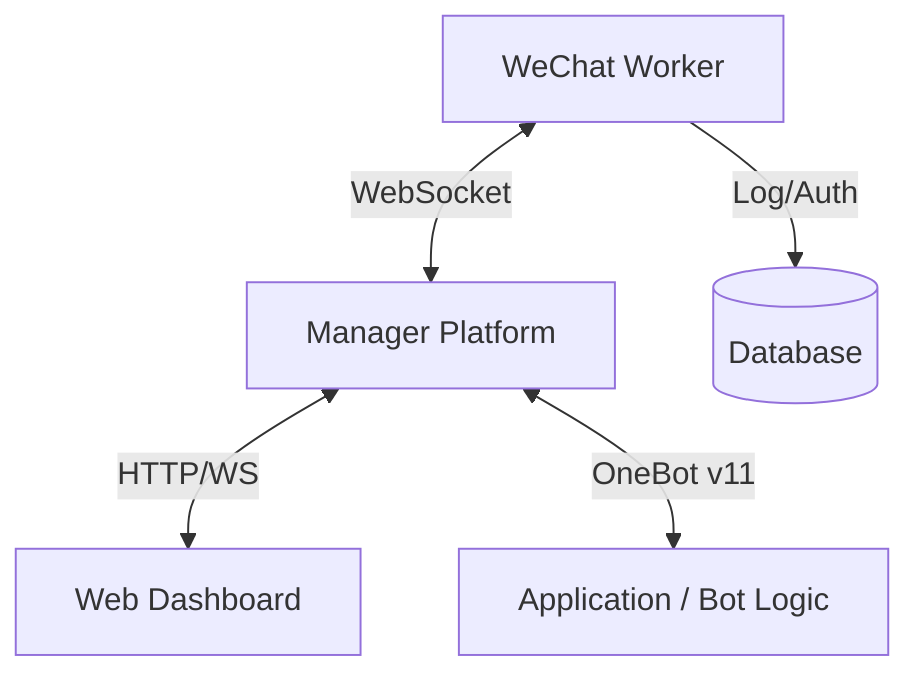

<div align="center">

# BotMatrix

**The Next-Generation OneBot Gateway & Management System**
**新一代 OneBot 协议网关与综合管理系统**

## 📂 Project Structure | 项目结构

```text
BotMatrix/
├── BotNexus/            # [Go] Central Management & Gateway (控制中枢)
│   ├── main.go          # Entry point
│   └── index.html       # Web Dashboard
├── WxBot/               # [Python] Robot Workers (机器人节点)
│   ├── bots/            # Bot implementations (WeChat, DingTalk, etc.)
│   └── worker.py        # Worker entry point
├── scripts/             # Deployment scripts
└── docker-compose.yml   # Orchestration
```

[](https://www.python.org/)
[](LICENSE)
[](Dockerfile)
[]()

[Features](#-features) • [Quick Start](#-quick-start) • [Dashboard](#-web-dashboard) • [Documentation](SERVER_MANUAL.md)

</div>

---

## 📖 Introduction

**BotMatrix** is a high-performance, event-driven middleware designed to bridge the gap between WeChat clients and modern automation workflows. Built on the **OneBot v11** standard, it provides a robust WebSocket gateway, a powerful plugin system, and a beautiful web-based dashboard for real-time monitoring and management.

BotMatrix 是一个高性能、事件驱动的中间件，旨在连接微信客户端与现代自动化工作流。基于 **OneBot v11** 标准构建，它提供了稳健的 WebSocket 网关、强大的插件系统以及美观的 Web 仪表盘，用于实时监控和管理。

## 🚀 Features

### ⚡ Core Capabilities
- **OneBot v11 Protocol**: Fully compatible implementation for seamless integration with existing bot ecosystems.
- **WebSocket Event Stream**: Real-time message routing and event dispatching with low latency.
- **Hot-Swappable Plugins**: Update logic on the fly without restarting the core service using `#reload`.
- **Database Integration**: Built-in support for SQL Server to log chats and manage user permissions.

### 📊 Web Dashboard
- **System Monitor**: Real-time CPU, RAM, and Network usage charts.
- **Live Logs**: Watch the bot's internal logs stream directly to your browser.
- **QR Code Login**: Remotely scan QR codes to log in to the WeChat instance if disconnected.
- **Dark Mode**: A sleek, modern UI designed for late-night debugging.

## 🛠 Architecture



The system is designed with a **distributed architecture**:
- **Manager (`manager.py`)**: The central hub. It hosts the WebSocket Gateway (Port 3001) and the Web Dashboard (Port 5000). It does not run the bot logic itself but manages connections.
- **Worker (`worker.py`)**: The actual bot instance. It runs the WeChat client and connects to the Manager via WebSocket. You can run multiple workers on different machines.

## 🏁 Quick Start

### Prerequisites
- Python 3.9+
- SQL Server (Optional, for advanced logging)

### Installation

1. **Clone the repository**
   ```bash
   git clone https://github.com/changliaotong/BotMatrix.git
   cd BotMatrix
   ```

2. **Install Dependencies**
   ```bash
   pip install -r requirements.txt
   ```

3. **Configure**
   Copy the example config and edit it:
   ```bash
   cp config.sample.json config.json
   ```

4. **Run**

   **Mode A: All-in-One (Legacy)**
   Run everything in a single process (not recommended for production):
   ```bash
   python onebot.py
   ```

   **Mode B: Distributed (Recommended)**
   
   1. Start the Manager:
      ```bash
      python manager.py
      ```
   
   2. Start a Worker (in a new terminal):
      ```bash
      # Windows PowerShell
      $env:MANAGER_URL="ws://127.0.0.1:3001"
      $env:BOT_SELF_ID="123456"
      python worker.py
      
      # Linux / Mac
      export MANAGER_URL="ws://127.0.0.1:3001"
      export BOT_SELF_ID="123456"
      python worker.py
      ```

### 🐳 Docker Deployment (Recommended)

The easiest way to deploy is using Docker Compose, which automatically sets up the Manager and a Worker.

1. **Start Services**
   ```bash
   docker-compose up -d
   ```

2. **Access Dashboard**
   Open http://localhost:5000 in your browser.

3. **Scan QR Code**
   Check the logs of the `wxbot-worker` container to scan the QR code:
   ```bash
   docker logs -f wxbot-worker
   ```

## 🎮 Admin Commands

Manage your bot directly from the chat window:

| Command | Description |
|:---|:---|
| `#status` | Show system health (CPU, RAM, Uptime). |
| `#reload` | Hot-reload all plugins. |
| `#broadcast` | Send a message to all active groups. |
| `#gc` | Force Python garbage collection. |
| `#db_status` | Check database statistics. |

> For a full list of commands, please refer to the [Server Manual](SERVER_MANUAL.md).

## 📅 Changelog | 更新日志

### 2025-12-13
- **Stability**: Fixed WebSocket heartbeat synchronization issues to prevent frequent disconnection loops.
- **UI**: Enhanced bot login state detection in Web Dashboard. Fixed the issue where the QR code menu remained visible after successful login.
- **Deployment**: Added fast deployment mode (`python scripts/deploy.py --fast`) to update code and restart containers without rebuilding images.

## 📄 License

This project is licensed under the MIT License - see the [LICENSE](LICENSE) file for details.

---
<div align="center">
Made with ❤️ by the Open Source Community
</div>
