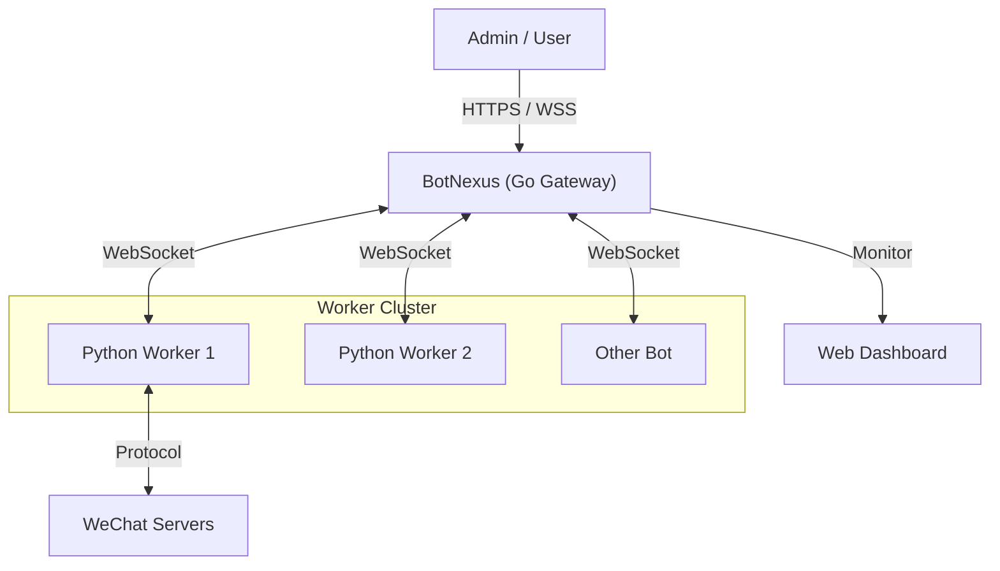

# BotMatrix 🌌

**The Next-Generation Enterprise Bot Management System**
**新一代企业级 OneBot 机器人集群管理系统**

[](https://go.dev/)
[](https://www.python.org/)
[](Dockerfile)
[](LICENSE)

---

## � Recent Updates | 最近更新

### v1.1.11 (2025-12-14)
*   **UI/UX Overhaul**: 
    *   **Dark Mode**: Fully optimized dark theme support for Dashboard, including modals, tables, and charts.
    *   **Group Avatars**: Added visual identification for groups using QQ avatar API.
    *   **Layout Fixes**: Improved "Groups & Friends" page layout, alignment, and removed redundant headers.
    *   **System Info**: Enhanced hardware info display (Host OS, Kernel) on the dashboard.
*   **Data Accuracy**:
    *   **Real-time Stats**: Fixed "Today's Active Groups" and "Dragon King" to correctly reflect *today's* data instead of historical totals.
    *   **Consistency**: Ensured consistency between dashboard widgets and detailed statistics views.
*   **Performance**: Optimized WebSocket message handling for bot group/friend counts.

---

## �📖 Introduction | 简介

**BotMatrix** is a high-performance, distributed robot management platform designed for enterprise scale. It decouples the connection layer from the logic layer, allowing for massive scalability and robust management.

*   **BotNexus (The Core)**: A high-concurrency Gateway written in **Go**. It provides a unified WebSocket interface, REST API, and a powerful **Real-time Dashboard**.
*   **WxBot (The Worker)**: A flexible Worker Node written in **Python**. It handles protocol adaptation (WeChat/OneBot) and executes business logic.

---

## ✨ Key Features | 核心功能

### 📊 Real-Time Visual Analytics (实时可视化分析)
> Experience the heartbeat of your bot cluster.
*   **Dynamic Charts**: Live visualization of **CPU Usage**, **Memory Trends**, and **Message Throughput (QPS)**.
*   **System Health**: Monitor Goroutines, GC cycles, and server uptime in real-time.
*   **Process Monitor**: Top 10 high-resource processes table to keep server performance in check.

### 🤖 Advanced Bot Fleet Management (集群管理)
*   **Unified List**: View all connected bots with details like **IP Address**, **Connection Duration**, and **Owner**.
*   **Status Tracking**: Instant visibility into bot health and connectivity.
*   **Remote Control**: Manage specific bots directly from the dashboard.

### 👥 User & Group Insights (用户与群组洞察)
*   **Activity Ranking**: "Top 5 Active Groups" and "Top 5 Active Users" (Dragon King) leaderboards.
*   **Member Management**: Search, ban, kick, or modify card names for group members via a unified UI.

### 🔒 Enterprise Security (企业级安全)
*   **Role-Based Access**: Granular permissions for **Admins** and standard **Users**.
*   **Multi-User Auth**: Secure login system with token-based authentication.

---

## 🛠 Architecture | 架构



## 📂 Project Structure | 项目结构

```text
BotMatrix/
├── BotNexus/            # [Go] The Brain (Gateway & Dashboard)
│   ├── main.go          # Core Logic
│   ├── index.html       # Modern Responsive UI (Bootstrap 5 + Chart.js)
│   └── Dockerfile       # Deployment config
├── WxBot/               # [Python] The Brawn (Worker Nodes)
│   ├── bots/            # Business Logic
│   └── web_ui.py        # Legacy UI (Deprecated)
└── docker-compose.yml   # One-Click Deployment
```

---

## 🏁 Quick Start (Docker) | 快速开始

### Prerequisites
*   Docker & Docker Compose
*   (Optional) Redis for data persistence

### 1. Deploy
```bash
git clone https://github.com/changliaotong/BotMatrix.git
cd BotMatrix
docker-compose up -d --build
```

### 2. Access
*   **Dashboard**: `http://localhost:5000` (Default Account: `admin` / `123456`)
*   **WebSocket Gateway**: `ws://localhost:3005`

### 3. Connect a Bot
The `WxBot` container will automatically try to connect to `BotNexus`.
1.  Open the Dashboard (`http://localhost:5000`).
2.  Watch the **Bot List** update in real-time as workers connect.
3.  Scan the QR code in the logs if required.

---

## 📄 Documentation

For detailed server deployment and API documentation, please refer to [docs/DEPLOY.md](docs/DEPLOY.md).

---

*Made with ❤️ by BotMatrix Team*
