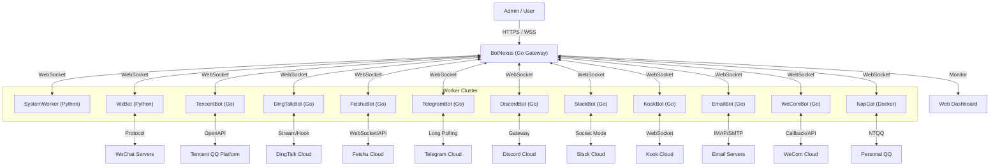

# BotMatrix 🌌

**The Next-Generation Enterprise Bot Management System**
**新一代企业级 OneBot 机器人集群管理系统**

[](https://go.dev/)
[](https://www.python.org/)
[](Dockerfile)
[](LICENSE)

---

## 📢 Recent Updates | 最近更新

### v1.1.89 - 3D Visualization Refinement & Protocol Robustness
*   **✨ Shaking Nexus Core**: Added a high-frequency shaking effect to the central Nexus node to symbolize its status as an active energy core.
*   **🌌 Dynamic Cosmic Scaling**: Inactive user nodes now smoothly drift to a further "Outer Rim", while active users stay in the core area.
*   **🌠 Full Trajectory Content Sync**: Message holographic hints now follow the exact 3D arc trajectory of the message particles.
*   **🔧 OneBot 11 Echo Normalization**: Fixed a critical issue where non-string `echo` fields caused type assertion failures.
*   **📡 Consistent Platform Forwarding**: Added missing `platform` field to `RoutingEvent` for consistent avatar matching.
*   **🛡️ Undefined Variable Fix**: Resolved a compile error in `handlers.go`.
*   **👥 WxBot Group Member Fix**: Fixed `get_group_member_info` in `WxBot` for correct ID mapping.

### v1.1.88 - 3D Cosmic Visualization & Load Balancing Optimization
*   **✨ 3D Routing Visualizer**: Refactored the forwarding path page into a high-performance Three.js 3D environment with smooth drifting animations.
*   **🔮 Holographic Message Hints**: Introduced animated holographic message hints that float up from nodes in real-time.
*   **⚖️ Intelligent Load Balancing**: Upgraded worker selection algorithm to prioritize `AvgProcessTime` over RTT.
*   **🖼️ High-Tech Avatar System**: Implemented matrix-inspired 3D node sprites with integrated platform avatars and glow effects.
*   **👤 Dynamic User Clustering**: Added user nodes with "drifting" logic where inactive users slowly move to the periphery.

### v1.1.83 - Bot ID & Routing Engine
*   **🆔 Dynamic Bot Identification**: Bots now automatically transition from temporary IP-based IDs to real QQ IDs using handshake headers.
*   **🎯 Advanced Routing Engine**: Fixed and enhanced routing rules with support for exact matches and wildcard patterns.
*   **⚡ Priority Routing System**: New routing logic follows a strict hierarchy: Exact Match > Wildcard Match > Intelligent Load Balancing.
*   **🛡️ High Availability**: Improved routing resilience with automatic fallback to healthy workers.
*   **🙈 UI Privacy**: Refined dashboard by hiding operating system details for a cleaner management interface.

### v1.1.82 - Dashboard Metrics & API Alignment
*   **📊 Worker Metrics Integration**: Added a dedicated "Workers" metric card to the dashboard and updated the global stats API to include real-time worker counts.
*   **🔧 API Contract Alignment**: Fixed `/api/bots` and `/api/workers` endpoints to return raw arrays, ensuring compatibility with frontend rendering logic.
*   **✅ Bot Data Enrichment**: Added `self_id` and `is_alive` fields to bot responses, fixing the global bot selection dropdown and status badges.
*   **💾 State Persistence**: Enhanced dashboard state persistence by including worker counts in local storage cache for immediate display.

### v1.1.81 - Unified Login & SQLite Persistence
*   **🔐 Unified Login System**: Redesigned a modern, full-page responsive login interface consistent across the ecosystem.
*   **💾 SQLite Database Integration**: Replaced temporary Redis user storage with persistent SQLite database, resolving the issue of losing passwords after service restarts.
*   **🛡️ Enhanced Security**: Improved admin initialization with automatic password hashing (bcrypt) and secure session management.
*   **📊 Comprehensive Dashboard**: Fixed system statistics rendering, ensuring all metrics (CPU, Memory, Goroutines, Bot Count) are displayed accurately without "undefined" values.
*   **🔗 SSO Integration**: Seamless single sign-on (SSO) between BotNexus and Overmind web UI via secure token passing.
*   **🌐 Localization Fixes**: Fixed login button functionality and multi-language support for the unified login page.
*   **📈 Real-time Monitoring**: Added missing system stats endpoints and implemented auto-refresh logic for the monitoring dashboard.
*   **📡 WebSocket Stability**: Fixed persistent WebSocket connection errors by correcting URL construction and ensuring proper endpoint mapping in the backend.

### v1.1.80 - UI & Overmind Integration
*   **🎨 UI Modernization**: Comprehensive overhaul of the management dashboard with improved responsiveness and dark mode support.
*   **🧠 Overmind Web Integration**: Embedded Overmind's powerful management tools directly into the BotNexus dashboard.
*   **📊 Trend Visualization**: Added historical trend charts for CPU, Memory, and Message throughput.

### v1.1.70 - Message Retry Mechanism
*   **🔄 Automatic Message Retry**: Added intelligent retry mechanism for failed bot message deliveries, ensuring reliable message transmission.
*   **⏱️ Exponential Backoff**: Implemented smart retry timing (1s, 2s, 4s intervals) to prevent system overload during recovery attempts.
*   **🎯 Max Retry Limit**: Configurable retry attempts (default: 3) with automatic cleanup of expired messages after 5 minutes.
*   **📊 Queue Management**: Enhanced `/api/queue/messages` API provides detailed retry queue status including retry count, next retry time, and error details.
*   **⚡ Background Processing**: Dedicated background worker processes retry queue every 5 seconds for efficient message recovery.
*   **🔒 Thread-Safe**: All retry operations are protected by mutex locks for concurrent access safety.

### v1.1.69 - Worker-Bot Bidirectional Communication
*   **🔧 Request-Response Mapping**: Implemented complete request-response mapping system using echo field to track pending requests.
*   **🔄 Worker→Bot Request Forwarding**: Workers can now send API requests to bots for operations like member checks, admin verification, muting, or kicking.
*   **📨 Bot→Worker Response Relay**: Bot responses are automatically relayed back to the originating worker using the echo identifier.
*   **⏱️ Timeout Management**: 30-second timeout for pending requests with automatic cleanup and error response generation.
*   **🛡️ Error Handling**: Comprehensive error handling for unavailable bots, forwarding failures, and request timeouts.
*   **🧪 Test Interface**: Added `test_worker_bot_api.html` for comprehensive testing of bidirectional communication scenarios.

### v1.1.68 - Routing Logic Fix & Enhanced Worker Management
*   **🎯 Corrected Routing Logic**: Fixed message routing to properly distinguish between API requests (random worker selection) and message events (routing rule application).
*   **🔧 Worker ID Optimization**: Shortened worker IDs for better readability and management.
*   **🔄 Duplicate ID Prevention**: Added retry mechanism to prevent duplicate worker IDs with 10-attempt retry loop.
*   **💓 Enhanced Heartbeat**: Improved worker connection stability with ping/pong mechanism and 60-second timeout detection.
*   **📊 Routing Test Tool**: Added `test_routing_simple.html` for easy validation of routing rule functionality.
*   **🛡️ Load Balancing**: API requests now use proper round-robin load balancing when no target bot is available.

### v1.1.67 - Worker Heartbeat Fix & Routing Rules
*   **💓 Worker Heartbeat Fix**: Fixed worker heartbeat logic to only update specific worker heartbeat times, preventing false timeout disconnections.
*   **🔧 Routing Rules Implementation**: Added intelligent message routing to direct specific group or bot messages to designated workers.
*   **🔐 Admin API**: New `/api/admin/routing` REST API for managing routing rules (admin only).
*   **🔄 Priority Routing**: Messages first check routing rules before falling back to round-robin load balancing.
*   **🛡️ Failure Recovery**: Automatic fallback to round-robin if designated worker is unavailable.
*   **📊 UI Enhancements**: Overmind routing screen now displays worker handled counts and improved dropdown selection.

### v1.1.66 - Cross-Bot Message Prevention
*   **🔒 Enhanced Message Routing Security**: Completely removed fallback logic that could cause messages to be sent to incorrect bots.
*   **🚫 Strict Target Validation**: Messages with invalid or missing self_id (including "0") are now rejected instead of being routed to random bots.
*   **🔄 Simplified Worker Architecture**: Removed Worker-BotID binding logic as Workers are designed to be shared competing consumers.
*   **📋 Improved Error Logging**: Enhanced error messages to clearly indicate when messages are rejected due to invalid target bot identification.
*   **🏷️ Worker ID Tracking**: Added unique ID assignment for better Worker connection tracking and debugging.

### v1.1.65 - Message Queue System Enhancement
*   **🔄 Separated Retry Queue**: Completely separated message persistence queue from retry queue to prevent successful messages from being re-sent.
*   **💾 Retry Queue Isolation**: Failed messages now go into a dedicated retry queue instead of being mixed with the persistence queue.
*   **📊 Queue Management APIs**: Added new REST API endpoints (`/api/queue/messages` and `/api/queue/retries`) for monitoring both persistence and retry queue status.
*   **🔧 Enhanced Retry Logic**: Improved retry processing to only handle messages in the retry queue, preventing interference with successful message deliveries.

> For detailed update history, please refer to [CHANGELOG.md](CHANGELOG.md).
>
> 更多更新记录请查看 [CHANGELOG.md](CHANGELOG.md)。

---

## 🚀 Getting Started | 快速开始

### Prerequisites | 环境要求
*   **Go**: 1.19+ (For BotNexus & Go-based Workers)
*   **Python**: 3.9+ (For SystemWorker & WxBot)
*   **Docker & Docker Compose**: Recommended for production deployment
*   **Flutter**: For building Overmind mobile/web dashboard (Optional)

### Installation | 安装步骤

1.  **Clone the Repository**
    ```bash
    git clone https://github.com/changliaotong/BotMatrix.git
    cd BotMatrix
    ```

2.  **Configuration**
    *   Copy `.env.example` to `.env` and configure your environment variables.
    *   For each bot component (e.g., `WxBot`, `TencentBot`), copy `config.sample.json` to `config.json` in its respective directory.

3.  **Run with Docker Compose (Recommended)**
    ```bash
    docker-compose up -d
    ```

4.  **Access the Dashboard**
    *   Open your browser and navigate to `http://localhost:8080` (or your configured port).
    *   The Overmind dashboard is also available via `/overmind/` route.

---

## 📂 Project Structure | 项目结构

| Directory | Description | Language |
| :--- | :--- | :--- |
| `BotNexus/` | Central Gateway & Management API | Go |
| `Overmind/` | Cross-platform Management Dashboard | Flutter |
| `WxBotGo/` | High-performance WeChat Bot (Android/UOS) | Go |
| `WxBot/` | Legacy/Feature-rich WeChat Bot | Python |
| `SystemWorker/` | System Monitoring & Remote Execution | Python |
| `TencentBot/` | Official QQ Guild/Group Support | Go |
| `DingTalkBot/` | Enterprise DingTalk Integration | Go |
| `FeishuBot/` | Modern Feishu/Lark Integration | Go |
| `docs/` | Detailed Technical Documentation | Markdown |

---

## 🛠 Deployment | 部署指南

We provide a unified deployment script `deploy.py` for simplified lifecycle management:

```bash
# Bump version and pack project
python deploy.py --target all --mode full

# Fast update (restart containers without rebuild)
python deploy.py --target manager --mode fast
```

Detailed deployment guides can be found in [docs/DEPLOY.md](docs/DEPLOY.md).

---

## 🤝 Contributing | 贡献指南

Contributions are welcome! Please feel free to submit a Pull Request. For major changes, please open an issue first to discuss what you would like to change.

---

## 📜 License | 开源协议

This project is licensed under the **MIT License** - see the [LICENSE](LICENSE) file for details.

---

## 📖 Introduction | 简介

**BotMatrix** is a high-performance, distributed robot management platform designed for enterprise scale. It decouples the connection layer from the logic layer, allowing for massive scalability and robust management.

*   **BotNexus (The Core)**: A high-concurrency Gateway written in **Go**. It provides a unified WebSocket interface, REST API, and a powerful **Real-time Dashboard**.
*   **SystemWorker (The Brain)**: A system-level **Python** worker. It handles global commands, visualizes status, and executes remote code.
*   **WxBot (The Bot)**: A flexible Bot Node written in **Python**. It handles protocol adaptation (WeChat/OneBot) and executes business logic.
*   **WeComBot (Enterprise)**: A **Go-based** implementation for WeChat Work (WeCom), supporting internal app integration via callbacks.
*   **NapCat (Personal)**: A **Containerized** implementation for Personal QQ, utilizing NTQQ and OneBot 11.
*   **TencentBot (The Official Worker)**: A high-performance Worker written in **Go**, utilizing the official Tencent Bot SDK (`botgo`) for stable, compliant QQ Guild and Group operations.
*   **DingTalkBot (The Enterprise Worker)**: A **Go-based** implementation supporting DingTalk's Webhook and Stream Mode for enterprise internal integration.
*   **FeishuBot (The Modern Worker)**: A **Go-based** implementation for Feishu/Lark, utilizing official WebSocket SDK for secure, firewall-friendly enterprise operations.
*   **TelegramBot (International)**: A **Go-based** implementation for Telegram, connecting via Long Polling.
*   **DiscordBot (Community)**: A **Go-based** implementation for Discord, supporting channel messages and DMs.
*   **SlackBot (Enterprise)**: A **Go-based** implementation for Slack, utilizing Socket Mode for enterprise integration.
*   **KookBot (Community)**: A **Go-based** implementation for Kook (Kaiheila), utilizing WebSocket for real-time interaction.
*   **EmailBot (Utility)**: A **Go-based** implementation for Email (IMAP/SMTP), bridging emails to OneBot messages.

---

## ✨ Key Features | 核心功能

### 📊 Real-Time Visual Analytics (实时可视化分析)
> Experience the heartbeat of your bot cluster.
*   **Dynamic Charts**: Live visualization of **CPU Usage**, **Memory Trends**, and **Message Throughput (QPS)**.
*   **System Health**: Monitor Goroutines, GC cycles, and server uptime in real-time.
*   **Process Monitor**: Top 10 high-resource processes table to keep server performance in check.

### 🤖 Advanced Bot Fleet Management (集群管理)
*   **Unified List**: View all connected bots with details like **IP Address**, **Connection Duration**, and **Owner**.
*   **Status Tracking**: Instant visibility into bot health and connectivity.
*   **Remote Control**: Manage specific bots directly from the dashboard.

### 👥 User & Group Insights (用户与群组洞察)
*   **Activity Ranking**: "Top 5 Active Groups" and "Top 5 Active Users" (Dragon King) leaderboards.
*   **Member Management**: Search, ban, kick, or modify card names for group members via a unified UI.

### 🔒 Enterprise Security (企业级安全)
*   **Role-Based Access**: Granular permissions for **Admins** and standard **Users**.
*   **Multi-User Auth**: Secure login system with token-based authentication.

### 🔥 Burn After Reading (阅后即焚)
> *Privacy First, Trace Free.*
*   **Secure & Ephemeral**: Auto-recall messages after a configurable delay (0-120s).
*   **High-End Privacy**: Ensure sensitive info vanishes without a trace.
*   **Universal Control**: Seamlessly integrated into the dashboard for supported bots.

### 📜 Centralized Log Management (集中式日志管理)
> *See it all in one place.*
*   **Unified View**: Monitor console logs from all connected bots directly in the dashboard.
*   **Smart Display**: Auto-truncates long logs with click-to-expand; auto-pauses refresh on interaction.
*   **Real-Time Streaming**: Logs are streamed via WebSocket with practically zero latency.
*   **Per-Bot Filtering**: Easily switch between viewing system logs or specific bot logs.

### 🐳 Docker Container Management (容器管理)
> *Control your infrastructure.*
*   **Visual Management**: View and manage Docker containers directly from the sidebar.
*   **Status at a Glance**: Check container ID, names, image, and running status instantly.
*   **One-Click Refresh**: Keep track of container changes in real-time.

### 🧠 Overmind Integration (Overmind 集成)
> *Next-level control.*
*   **Seamless Access**: One-click navigation to the Overmind frontend directly from the sidebar.
*   **Unified Workflow**: Manage your bot cluster and Overmind system without switching contexts.

### 🧠 Intelligent Robot Collaboration (机器人智能协作)
> *One Click, Full Linkage.*
*   **Smart Wake-Up**: Bypasses Tencent Guild Bot restrictions (passive reply only) by coordinating with ordinary bots to "wake up" guild bots via @mentions.
*   **Cross-Protocol Synergy**: Bridges the gap between different bot platforms (e.g., QQ Guild ↔ QQ Group).
*   **Unstoppable Workflow**: Ensures critical messages are delivered even under strict platform limitations. [Read More](docs/QQ_GUILD_SMART_SEND_CN.md).

### 🎯 Intelligent Message Routing (智能消息路由)
> *Smart Load Balancing & Fixed Routing.*
*   **Dual Routing Modes**: 
  *   **API Requests**: External requests use round-robin load balancing for optimal worker distribution
  *   **Message Events**: Bot messages apply intelligent routing rules for targeted worker selection
*   **Priority Routing**: Messages first check routing rules (group_id/bot_id → worker_id) before falling back to random selection
*   **Enterprise Use Cases**: 
  *   **VIP Users**: Route high-priority users to dedicated high-performance workers
  *   **Testing Environment**: Direct test messages to specific workers for debugging
  *   **Load Distribution**: Balance workload across workers based on business requirements
*   **Admin Management**: REST API (`/api/admin/routing`) for dynamic routing rule configuration
*   **Failure Recovery**: Automatic fallback to round-robin if designated worker is unavailable
*   **Real-time Validation**: Built-in test tools for routing rule functionality verification

---

## 🛠 Architecture | 架构



## 📂 Project Structure | 项目结构

```text
BotMatrix/
├── BotNexus/            # [Go] The Brain (Gateway & Dashboard)
│   ├── main.go          # Core Logic
│   ├── index.html       # Modern Responsive UI (Bootstrap 5 + Chart.js)
│   └── Dockerfile       # Deployment config
├── WxBot/               # [Python] The Brawn (WeChat Bot)
│   ├── bots/            # Business Logic
│   └── web_ui.py        # Legacy UI (Deprecated)
├── TencentBot/          # [Go] The Official (QQ Worker)
│   ├── main.go          # BotGo Implementation
│   └── config.json      # Bot Configuration
├── DingTalkBot/         # [Go] The Enterprise (DingTalk Worker)
│   ├── main.go          # Stream/Webhook Implementation
│   └── config.json      # Dual-mode Config
├── FeishuBot/           # [Go] The Modern (Feishu Worker)
│   ├── main.go          # WebSocket Implementation
│   └── config.json      # App Config
├── TelegramBot/         # [Go] The International (Telegram Worker)
│   ├── main.go          # Long Polling Implementation
│   └── config.json      # Bot Token Config
├── DiscordBot/          # [Go] The Community (Discord Worker)
│   ├── main.go          # Gateway Implementation
│   └── config.json      # Bot Token Config
├── SlackBot/            # [Go] The Enterprise (Slack Worker)
│   ├── main.go          # Socket Mode Implementation
│   └── config.json      # App/Bot Token Config
├── KookBot/             # [Go] The Community (Kook Worker)
│   ├── main.go          # WebSocket Implementation
│   └── config.json      # Bot Token Config
├── EmailBot/            # [Go] The Utility (Email Worker)
│   ├── main.go          # IMAP/SMTP Implementation
│   └── config.json      # Server/Auth Config
├── WeComBot/            # [Go] The Enterprise (WeCom Worker)
│   ├── main.go          # Callback/API Implementation
│   └── config.json      # App/Token Config
├── NapCat/              # [Docker] The Personal (QQ Worker)
│   ├── config/          # OneBot 11 Config
│   └── qq/              # QQ Session Data
└── docker-compose.yml   # One-Click Deployment
```

---

## 🏁 Quick Start (Docker) | 快速开始

### Prerequisites
*   Docker & Docker Compose
*   (Optional) Redis for data persistence

### 1. Deploy
```bash
git clone https://github.com/changliaotong/BotMatrix.git
cd BotMatrix

# Configure TencentBot (Optional)
cp TencentBot/config.sample.json TencentBot/config.json
# Edit TencentBot/config.json with your AppID and Secret

docker-compose up -d --build
```

### 2. Access
*   **Dashboard**: `http://localhost:5000` (Default Account: `admin` / `admin123`)
*   **WebSocket Gateway**: `ws://localhost:3005`

### 3. Connect a Bot
The `WxBot` container will automatically try to connect to `BotNexus`.
1.  Open the Dashboard (`http://localhost:5000`).
2.  Watch the **Bot List** update in real-time as workers connect.
3.  Scan the QR code in the logs if required.

---

## 📚 Documentation | 文档导航

- **部署与维护 / Deployment & Ops**
  - [docs/DEPLOY.md](docs/DEPLOY.md) - **Docker 部署与远程自动部署脚本使用说明**（推荐从这里开始）
  - [docs/SERVER_MANUAL.md](docs/SERVER_MANUAL.md) - **旧版 Python OneBot 网关服务端手册（Legacy / 兼容文档）**  
    > 当前推荐架构为：`BotNexus (Go 网关)` + 各平台 Bot Worker + `SystemWorker`，Python 网关仅用于兼容老项目。

- **特性与协议说明 / Features & Protocols**
  - [docs/QQ_GUILD_SMART_SEND_CN.md](docs/QQ_GUILD_SMART_SEND_CN.md) - QQ 频道/群组 **智能协作发送（Smart Send / WakeUp）** 机制说明
  - [docs/CSharpReconnectExample.cs](docs/CSharpReconnectExample.cs) - C# 客户端重连示例代码
  - `BotNexus/test_routing_simple.html` - **路由规则测试工具**（Web界面用于验证消息路由功能）

- **客户端 / Clients**
  - `Overmind/README.md` - Overmind 可视化控制台（Flutter 桌面/移动端）
  - `wx_bot_app/README.md` - 实验性移动端控制应用（Flutter）

- **子模块 / Bots & Workers**
  - `BotNexus/` - Go 网关与 Web 面板
  - `SystemWorker/README.md` - SystemWorker 系统 Worker 说明
  - 各平台 Bot：`WxBot/`, `TencentBot/`, `DingTalkBot/`, `FeishuBot/`, `TelegramBot/`, `DiscordBot/`, `SlackBot/`, `KookBot/`, `WeComBot/`, `EmailBot/` 等目录下均有各自的 `README.md`（使用前建议阅读对应文档）

---

*Made with ❤️ by BotMatrix Team*
