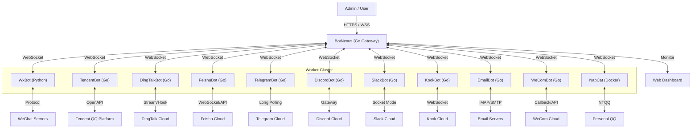

# BotMatrix 🌌

**The Next-Generation Enterprise Bot Management System**
**新一代企业级 OneBot 机器人集群管理系统**

[](https://go.dev/)
[](https://www.python.org/)
[](Dockerfile)
[](LICENSE)

---

## 📢 Recent Updates | 最近更新

### v1.1.16 (2025-12-15)
*   **New Integrations**:
    *   **KookBot**: Added support for Kook (Kaiheila) community platform.
    *   **EmailBot**: Added bidirectional Email support (IMAP/SMTP) bridged to OneBot.
    *   **WeComBot**: Added Enterprise WeChat support via Callback/API.
    *   **NapCat**: Integrated NapCat (NTQQ) for personal QQ account automation.
*   **Documentation**:
    *   Comprehensive deployment guide covering all 10+ bot platforms.

### v1.1.15 (2025-12-15)
*   **TencentBot Enhanced**:
    *   **Strict Separation**: Completely separated **QQ Group** and **Guild Channel** logic to align with platform concepts.
    *   **New APIs**: Added comprehensive support for Guild Channel management (Create/Delete Channels, Role Management, Member Kick, etc.).
    *   **Deployment**: Optimized targeted deployment via `deploy.ps1`.
*   **Documentation**:
    *   Updated README and Architecture diagrams to reflect the new multi-bot ecosystem.

### v1.1.14 (2025-12-15)
*   **Deployment**:
    *   **Configuration**: Simplified Docker deployment by consolidating configuration into `config.json` for TencentBot, removing duplicate environment variables.
    *   **Persistence**: Ensured configuration persistence via Docker volume mounting.
*   **Tencent Official Bot**:
    *   **Build Fix**: Resolved build errors related to token initialization and SDK compatibility.

### v1.1.13 (2025-12-15)
*   **New Bot Type**:
    *   **Tencent Official Bot**: Added support for Tencent's official QQ Bot platform (`QQOfficial`) using the official `botgo` SDK.
    *   **BotNexus Integration**: Native integration for official bots with correct platform identification and message translation to OneBot 11 standard.
*   **Data Accuracy Improvements**:
    *   **Dragon King Fix**: Excluded bot's own messages from "Top Active Users" statistics to ensure leaderboard accuracy.
    *   **Bot Status Fix**: Resolved a critical panic when accessing group counts for offline bots.
    *   **Platform Info**: Fixed platform display in the bot list to correctly show "QQOfficial" or other custom platforms instead of defaulting to "QQ".

### v1.1.12 (2025-12-15)
*   **Internationalization (i18n)**:
    *   **Complete Coverage**: Full support for **Simplified Chinese**, **Traditional Chinese**, and **English** across all UI components.
    *   **Debug Tools**: Added translations for the "Raw API" debugger and message type selectors.
*   **Core Stability**:
    *   **Data Accuracy**: Fixed daily statistics reset logic to ensure "Today's Active Users/Groups" are perfectly accurate.
    *   **OneBot Compatibility**: Enhanced ID parsing (int/string/float) for broader client compatibility (e.g., WXBot).
    *   **Group/Friend Sync**: Resolved issue where group and friend counts would display as 0 by improving synchronization logic.
*   **System Info**: Fixed Host OS and Kernel version display for accurate server monitoring.

### v1.1.11 (2025-12-14)
*   **UI/UX Overhaul**: 
    *   **Dark Mode**: Fully optimized dark theme support for Dashboard, including modals, tables, and charts.
    *   **Group Avatars**: Added visual identification for groups using QQ avatar API.
    *   **Layout Fixes**: Improved "Groups & Friends" page layout, alignment, and removed redundant headers.
    *   **System Info**: Enhanced hardware info display (Host OS, Kernel) on the dashboard.
*   **Data Accuracy**:
    *   **Real-time Stats**: Fixed "Today's Active Groups" and "Dragon King" to correctly reflect *today's* data instead of historical totals.
    *   **Consistency**: Ensured consistency between dashboard widgets and detailed statistics views.
*   **Performance**: Optimized WebSocket message handling for bot group/friend counts.

---

## �📖 Introduction | 简介

**BotMatrix** is a high-performance, distributed robot management platform designed for enterprise scale. It decouples the connection layer from the logic layer, allowing for massive scalability and robust management.

*   **BotNexus (The Core)**: A high-concurrency Gateway written in **Go**. It provides a unified WebSocket interface, REST API, and a powerful **Real-time Dashboard**.
*   **WxBot (The Worker)**: A flexible Worker Node written in **Python**. It handles protocol adaptation (WeChat/OneBot) and executes business logic.
*   **WeComBot (Enterprise)**: A **Go-based** implementation for WeChat Work (WeCom), supporting internal app integration via callbacks.
*   **NapCat (Personal)**: A **Containerized** implementation for Personal QQ, utilizing NTQQ and OneBot 11.
*   **TencentBot (The Official Worker)**: A high-performance Worker written in **Go**, utilizing the official Tencent Bot SDK (`botgo`) for stable, compliant QQ Guild and Group operations.
*   **DingTalkBot (The Enterprise Worker)**: A **Go-based** implementation supporting DingTalk's Webhook and Stream Mode for enterprise internal integration.
*   **FeishuBot (The Modern Worker)**: A **Go-based** implementation for Feishu/Lark, utilizing official WebSocket SDK for secure, firewall-friendly enterprise operations.
*   **TelegramBot (International)**: A **Go-based** implementation for Telegram, connecting via Long Polling.
*   **DiscordBot (Community)**: A **Go-based** implementation for Discord, supporting channel messages and DMs.
*   **SlackBot (Enterprise)**: A **Go-based** implementation for Slack, utilizing Socket Mode for enterprise integration.
*   **KookBot (Community)**: A **Go-based** implementation for Kook (Kaiheila), utilizing WebSocket for real-time interaction.
*   **EmailBot (Utility)**: A **Go-based** implementation for Email (IMAP/SMTP), bridging emails to OneBot messages.

---

## ✨ Key Features | 核心功能

### 📊 Real-Time Visual Analytics (实时可视化分析)
> Experience the heartbeat of your bot cluster.
*   **Dynamic Charts**: Live visualization of **CPU Usage**, **Memory Trends**, and **Message Throughput (QPS)**.
*   **System Health**: Monitor Goroutines, GC cycles, and server uptime in real-time.
*   **Process Monitor**: Top 10 high-resource processes table to keep server performance in check.

### 🤖 Advanced Bot Fleet Management (集群管理)
*   **Unified List**: View all connected bots with details like **IP Address**, **Connection Duration**, and **Owner**.
*   **Status Tracking**: Instant visibility into bot health and connectivity.
*   **Remote Control**: Manage specific bots directly from the dashboard.

### 👥 User & Group Insights (用户与群组洞察)
*   **Activity Ranking**: "Top 5 Active Groups" and "Top 5 Active Users" (Dragon King) leaderboards.
*   **Member Management**: Search, ban, kick, or modify card names for group members via a unified UI.

### 🔒 Enterprise Security (企业级安全)
*   **Role-Based Access**: Granular permissions for **Admins** and standard **Users**.
*   **Multi-User Auth**: Secure login system with token-based authentication.

---

## 🛠 Architecture | 架构



## 📂 Project Structure | 项目结构

```text
BotMatrix/
├── BotNexus/            # [Go] The Brain (Gateway & Dashboard)
│   ├── main.go          # Core Logic
│   ├── index.html       # Modern Responsive UI (Bootstrap 5 + Chart.js)
│   └── Dockerfile       # Deployment config
├── WxBot/               # [Python] The Brawn (WeChat Worker)
│   ├── bots/            # Business Logic
│   └── web_ui.py        # Legacy UI (Deprecated)
├── TencentBot/          # [Go] The Official (QQ Worker)
│   ├── main.go          # BotGo Implementation
│   └── config.json      # Bot Configuration
├── DingTalkBot/         # [Go] The Enterprise (DingTalk Worker)
│   ├── main.go          # Stream/Webhook Implementation
│   └── config.json      # Dual-mode Config
├── FeishuBot/           # [Go] The Modern (Feishu Worker)
│   ├── main.go          # WebSocket Implementation
│   └── config.json      # App Config
├── TelegramBot/         # [Go] The International (Telegram Worker)
│   ├── main.go          # Long Polling Implementation
│   └── config.json      # Bot Token Config
├── DiscordBot/          # [Go] The Community (Discord Worker)
│   ├── main.go          # Gateway Implementation
│   └── config.json      # Bot Token Config
├── SlackBot/            # [Go] The Enterprise (Slack Worker)
│   ├── main.go          # Socket Mode Implementation
│   └── config.json      # App/Bot Token Config
├── KookBot/             # [Go] The Community (Kook Worker)
│   ├── main.go          # WebSocket Implementation
│   └── config.json      # Bot Token Config
├── EmailBot/            # [Go] The Utility (Email Worker)
│   ├── main.go          # IMAP/SMTP Implementation
│   └── config.json      # Server/Auth Config
├── WeComBot/            # [Go] The Enterprise (WeCom Worker)
│   ├── main.go          # Callback/API Implementation
│   └── config.json      # App/Token Config
├── NapCat/              # [Docker] The Personal (QQ Worker)
│   ├── config/          # OneBot 11 Config
│   └── qq/              # QQ Session Data
└── docker-compose.yml   # One-Click Deployment
```

---

## 🏁 Quick Start (Docker) | 快速开始

### Prerequisites
*   Docker & Docker Compose
*   (Optional) Redis for data persistence

### 1. Deploy
```bash
git clone https://github.com/changliaotong/BotMatrix.git
cd BotMatrix

# Configure TencentBot (Optional)
cp TencentBot/config.sample.json TencentBot/config.json
# Edit TencentBot/config.json with your AppID and Secret

docker-compose up -d --build
```

### 2. Access
*   **Dashboard**: `http://localhost:5000` (Default Account: `admin` / `123456`)
*   **WebSocket Gateway**: `ws://localhost:3005`

### 3. Connect a Bot
The `WxBot` container will automatically try to connect to `BotNexus`.
1.  Open the Dashboard (`http://localhost:5000`).
2.  Watch the **Bot List** update in real-time as workers connect.
3.  Scan the QR code in the logs if required.

---

## 📄 Documentation

For detailed server deployment and API documentation, please refer to [docs/DEPLOY.md](docs/DEPLOY.md).

---

*Made with ❤️ by BotMatrix Team*
