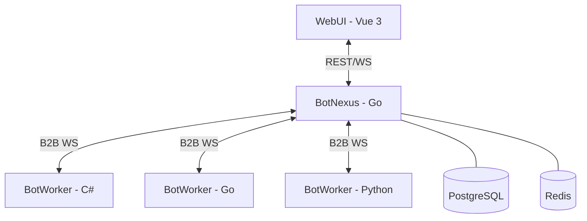
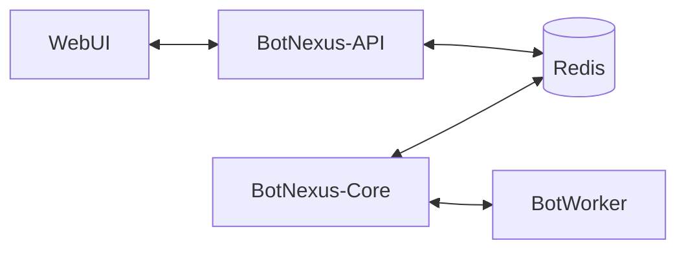

# BotMatrix 重构与规划方案 (Refactor & Planning)

## 1. 总体架构图

## 2. 重构路线图与职责划分

### 2.1 职责边界 (Responsibility Boundaries)

| 模块 | BotNexus (Go) - **大脑** | BotWorker (C#) - **肢体** |
| :--- | :--- | :--- |
| **身份验证** | 全局用户鉴权、JWT、权限校验 | 无 (仅信任 Nexus 转发的请求) |
| **数据管理** | 数据库 (PG/MySQL) 读写、Redis 缓存 | 无 (或仅用于本地临时缓存) |
| **机器人管理** | 实例调度、状态监控、配置下发 | 协议实现 (如 QQ/微信)、心跳上报 |
| **业务逻辑** | AI 意图编排、MCP 调度、全局自动化 | 具体的任务执行 (如文件处理、本地计算) |

### 2.2 C# 代码迁移优先级 (Migration Priority)

并不是所有 C# 代码都需要重写，我们的原则是 **“管理权上移，执行权下沉”**：

1. **必须重写 (高优先级)**:
    - `AuthService`: 统一由 Go 的中间件处理。
    - `BotStatsService`: 统一汇总到 Go，利用 Redis 实现持久化统计。
    - `BotConnectionService`: 机器人的注册与发现逻辑迁移到 Go。
2. **建议重写 (中优先级)**:
    - `Config/AppConfig`: 统一使用 Go 的配置中心。
    - 基础的 `Database` 访问层: 迁移到 GORM。
3. **保留或延后 (低优先级)**:
    - 具体的平台协议封装 (如对第三方 API 的复杂调用)。
    - 已有的成熟业务插件 (PluginMiddleware)。

### 2.3 演进阶段

#### 第一阶段：API 统一网关 (当前阶段)
- **目标**: WebUI 仅与 BotNexus 通信。
- **行动**: 
    - 在 BotNexus 中实现所有管理类 API（用户、统计、配置）。
    - 对于尚未迁移的业务逻辑，由 BotNexus 通过现有的 B2B 协议代理转发给 C# BotWorker。

#### 第二阶段：数据权属迁移
- **目标**: 将核心业务数据交由 Go 管理。
- **行动**: 
    - 使用 GORM 在 Go 中重写数据模型 (Models)。
    - C# BotWorker 逐渐转变为只读或受限写入模式。

#### 第三阶段：Worker 轻量化
- **目标**: C# BotWorker 仅作为“执行器”存在。
- **行动**: 
    - 剥离 C# 中的 User/Manager/Auth 逻辑。
    - 强化 B2B 协议，支持更复杂的任务下发与状态回传。

## 3. 网站 (WebUI) 功能与层级规划

### 3.1 网站层级结构 (Site Hierarchy)
为了兼顾商业运营与开源项目展示，网站采用以下层级：

- **首页 (/)**: **早喵机器人 (EarlyMeow)** 官方门户。展示核心业务、功能亮点及接入入口。
- **开源项目 (/matrix)**: BotMatrix/BotNexus 开源项目首页。展示架构设计、技术优势及 GitHub 链接。
- **其他机器人 (/bots/*)**: 将来上线的其他机器人产品。
- **文档 (/docs)**: 统一的开发者与用户手册。

### 3.2 用户控制台 (Console)
- **Dashboard**: 数据概览看板。
- **Bots**: 机器人实例管理、技能(MCP)配置（**当前重构重点：机器人设置**）。
- **Contacts**: 统一联系人/群组管理。
- **Tasks**: 自动化任务触发与日志。

### 3.3 系统管理 (Admin)
- **Nexus**: 监控枢纽状态、活跃连接。
- **Workers**: 负载均衡管理、Worker 性能分析。
- **Users**: 全局用户审核与权限控制。

## 4. 技术栈对齐与语言选型论证

### 4.1 Go vs C# (针对本项目)

| 维度 | Go (BotNexus) | C# (BotWorker) |
| :--- | :--- | :--- |
| **并发模型** | **Goroutines (轻量级)**: 极适合处理数万个 WebSocket 长连接。 | **Async/Await (任务模型)**: 适合复杂的异步业务流。 |
| **部署成本** | **极低**: 静态编译单文件，无依赖，适合 Docker/K8s。 | **中等**: 需要 .NET Runtime，镜像体积相对较大。 |
| **资源消耗** | **极少**: 内存占用极低，适合作为高频调度的“网关”。 | **较高**: 运行时占用较多内存，但在复杂业务计算上性能强劲。 |
| **生态偏向** | 云原生、网络中间件、微服务。 | 企业级开发、复杂领域驱动设计 (DDD)、GUI/桌面端。 |

### 4.2 为什么网站 API 推荐用 Go？

在 BotMatrix 的场景下，**Go 是更好的“网站后台/ API 网关”选择**，理由如下：
1. **高并发性能**: 网站后台需要同时处理 WebUI 的 REST 请求和来自多个 Worker 的 WebSocket 连接。Go 的原生并发模型处理这类“高频 IO”任务非常轻松。
2. **启动速度**: Go 的秒级启动对于微服务扩容和 CI/CD 非常友好。
3. **开发效率**: Go 的语法简单，对于重构管理层 API（如用户、权限、统计）速度非常快，且易于维护。

### 4.3 为什么保留 C#？
1. **利用既有资产**: 现有的协议对接和复杂业务逻辑已经在 C# 中稳定运行，无需为了重写而重写。
2. **复杂业务支持**: C# 拥有更丰富的 LINQ 和强大的类型系统，处理极其复杂的内部业务逻辑时，代码表达力比 Go 更强。

## 5. 部署架构演进：要不要“单独分出来”？

针对你提到的“网站和后台 API 是否需要独立于 BotNexus”的问题，建议遵循 **“逻辑隔离，物理按需”** 的原则。

### 5.1 当前阶段 (单体控制面)：合在一起
**建议**: 目前继续保持 BotNexus 作为统一的控制面（包含 API 和 消息转发）。
- **理由**: 
    - **低延迟**: API 需要实时获取 BotNexus 内存中的连接状态、Bot 状态。合在一起可以直接访问内存（通过 `Manager` 结构体），无需跨进程通信（RPC/HTTP）。
    - **部署简单**: 只需要维护一个 Go 进程。
    - **数据一致性**: 避免了两个程序之间状态同步的复杂性。

### 5.2 未来阶段 (微服务化)：分离
**什么时候需要分出来？**
- **连接数极高**: 当 BotNexus 维护的 WebSocket 连接超过数万，导致 GC 压力大影响 API 响应时。
- **安全性要求高**: 网站后台需要完全暴露在公网，而消息转发中心（Nexus）希望藏在更深的内网。
- **多区域部署**: 需要在全球多个节点部署转发中心，但只需要一个统一的 Web 管理控制台。

### 5.4 进阶架构：稳定性与灵活性分离 (Core vs API)

针对你提到的“网站频繁更新”与“转发中心需稳定运行”的矛盾，这是非常专业的考量。为了解决这个痛点，我们建议采用 **“双进程/双服务”** 架构：

#### 1. BotNexus-Core (稳定核心层)
- **目标**: 极致稳定，非必要不重启。
- **职责**: 
    - 维持与 BotWorker 的 WebSocket 长连接。
    - 基础的消息路由与分发。
    - 简单的健康检查。
- **特性**: 代码极其精简，依赖极少，确保数月不重启。

#### 2. BotNexus-API (动态业务层)
- **目标**: 快速迭代，频繁更新。
- **职责**: 
    - WebUI 的所有 REST API。
    - 用户管理、权限校验、数据库 CRUD。
    - 复杂的 AI 意图编排逻辑。
- **特性**: 允许根据产品需求随时重启部署，不影响底层的消息链路。

#### 3. 核心与业务的通信 (Decoupling)
- **状态共享**: 双方通过 **Redis** 共享机器人在线状态。
- **指令下发**: API 层通过 **Redis Pub/Sub** 或 **gRPC** 向 Core 层发送控制指令（如：让某个机器人发送消息）。
- **事件上报**: Core 层将接收到的消息事件推入 **Redis Stream/Queue**，API 层异步消费并处理。

## 6. 最终技术栈清单
- **Frontend**: Vue 3, Vite, Pinia, Tailwind CSS, TypeScript.
- **Backend**: Go (Gin, GORM), PostgreSQL, Redis.
- **Communication**: WebSocket (Nexus <-> Worker), REST/WS (WebUI <-> Nexus).
