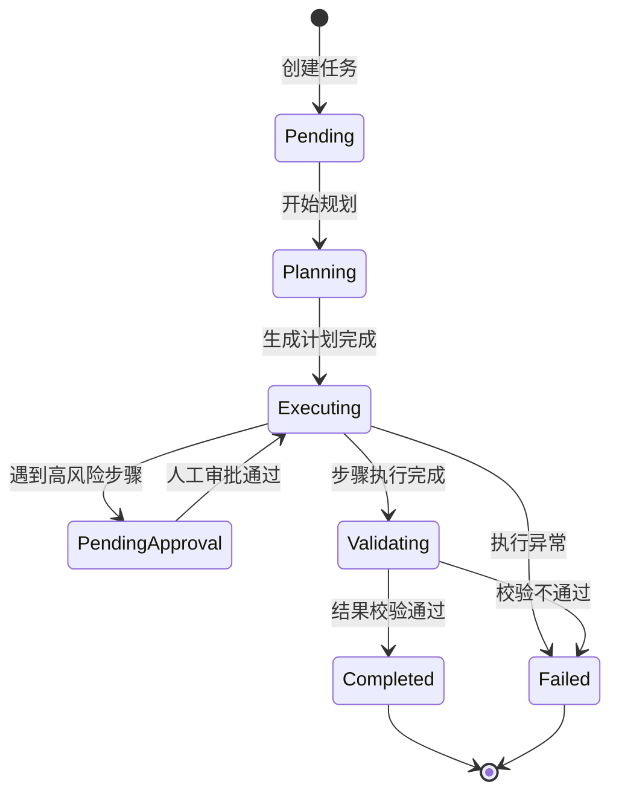

# 数字员工任务引擎 (Task Engine) 技术规格文档

## 1. 概述
数字员工任务引擎是 BotMatrix 平台的核心组件，负责管理数字员工从任务接收、计划生成、步骤执行到结果反馈的全生命周期。它集成了 AI 规划能力、MCP 外部工具调用以及人工干预 (HITL) 机制，支持复杂的跨部门协同工作流。

## 2. 核心概念

### 2.1 任务 (Task)
任务是数字员工工作的最小单元。每个任务包含：
- **ExecutionID**: 全局唯一的执行 ID，用于追踪。
- **Status**: 任务状态流转 (pending -> planning -> executing -> completed/failed)。
- **Plan**: 由 AI 生成的步骤化执行计划。
- **Results**: 每个步骤的执行结果记录。

### 2.2 任务计划 (Task Plan)
AI 将复杂的任务描述拆解为多个有序步骤。每个步骤包含：
- **Title**: 步骤标题。
- **Description**: 详细的操作指南。
- **Tool**: (可选) 调用的 MCP 工具名称。
- **RequiresApproval**: 是否需要人工审批后才能执行。

### 2.3 人工干预 (Human-in-the-Loop, HITL)
为了安全起见，引擎支持在关键步骤暂停。状态变为 `pending_approval`，直到管理员调用 `ApproveTask` 接口。

## 3. 任务状态机


## 4. 关键接口 (Service Interface)

```go
type DigitalEmployeeTaskService interface {
    // 基础管理
    CreateTask(ctx context.Context, task *models.DigitalEmployeeTaskGORM) error
    GetTaskByExecutionID(ctx context.Context, executionID string) (*models.DigitalEmployeeTaskGORM, error)
    
    // 执行流转
    PlanTask(ctx context.Context, executionID string) error      // AI 拆解步骤
    ExecuteTask(ctx context.Context, executionID string) error   // 循环执行步骤
    ApproveTask(ctx context.Context, executionID string) error   // 审批通过
    
    // 协作
    CreateSubTask(ctx context.Context, parentID string, subTask *models.DigitalEmployeeTaskGORM) error
}
```

## 5. 跨部门协作流程
1. **发起**: 部门 A 的数字员工（或管理员）创建任务，指派给部门 B 的数字员工。
2. **接收**: 部门 B 员工在待办列表中查看到任务。
3. **拆解**: 部门 B 员工执行过程中，如需其他部门协助，可创建子任务（Sub-Task）。
4. **同步**: 子任务完成后，自动触发父任务的后续步骤。

## 6. 岗位模板库 (Role Templates)
预置的标准岗位能力集：
- **行政助理**: 擅长日程、通知、文档。
- **技术支持**: 擅长日志分析、故障排查。
- **财务助手**: 擅长报销审核、对账。

## 7. 安全与合规
- **权限隔离**: 任务只能由指派的员工或其上级访问。
- **数据脱敏**: 在 AI 规划和执行过程中，敏感数据通过 `SecurityPolicy` 进行预处理。
- **操作审计**: 所有步骤结果（ResultRaw）永久留存，不可篡改。
