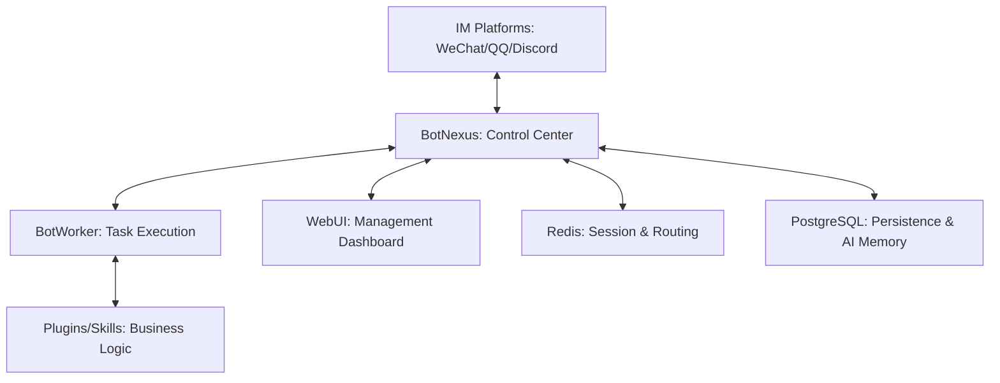

# 🏗️ BotMatrix Architecture & Component Overview

> **Version**: 2.0
> **Status**: Core architecture established
> [🌐 English](ARCHITECTURE.md) | [简体中文](../zh-CN/core/ARCHITECTURE.md)
> [⬅️ Back to Docs](README.md) | [🏠 Back to Home](../../README.md)

BotMatrix is a distributed, high-concurrency bot orchestration framework built on a decoupled architecture of "Control Center + Execution Nodes".

---

## 1. System Topology

---

## 2. Core Components

### 2.1 BotNexus (Central Controller)
The heart of the system, responsible for:
- **Connection Hub**: Maintains WebSocket connections with IM adapters (OneBot v11).
- **Dynamic Routing**: Dispatches messages to the appropriate Worker or AI Skill based on RTT and intent.
- **3D Topology**: Visualizes the system network using Three.js.
- **Security**: Handles JWT authentication and B2B Agent Mesh trust.

### 2.2 BotWorker (Task Executor)
The execution engine for business logic:
- **Plugin Host**: Runs multi-language plugins via JSON-STDIO.
- **Built-in Skills**: Utilities (Weather, Translate), Entertainment (Social, Games), and Management (Group Admin).
- **Stateless Design**: Allows easy horizontal scaling.

### 2.3 SystemWorker (Support Node)
Handles background tasks and system maintenance:
- **Cron Jobs**: Scheduled tasks like database cleanup or daily reports.
- **Log Aggregation**: Collects and stores logs from all nodes.

### 2.4 Overmind (API Gateway)
The management interface for the entire cluster:
- **RESTful API**: Powers the WebUI and mobile miniprogram.
- **Marketplace Sync**: Manages plugin installation and updates.

---

## 3. Communication Standards

- **Internal**: Redis Pub/Sub and gRPC.
- **External (IM)**: OneBot v11 (WebSocket).
- **AI/Mesh**: Model Context Protocol (MCP) over SSE/HTTP.

---

## 4. Message Lifecycle

1. **Ingress**: IM adapter sends OneBot event to BotNexus.
2. **Intent Identification**: Nexus analyzes intent (AI or Keyword).
3. **Routing**: Nexus dispatches task to an available Worker.
4. **Execution**: Worker processes logic (via Plugin or Built-in Skill).
5. **Egress**: Worker returns response to Nexus, which forwards it to the IM adapter.
