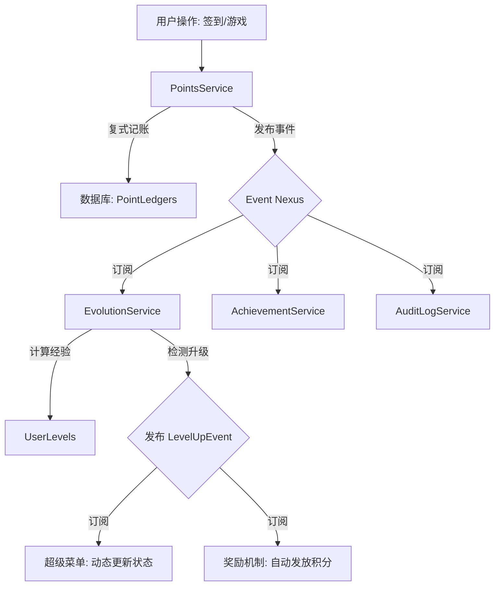

# BotMatrix Event Nexus & Evolution 系统架构白皮书

## 1. 核心理念：什么是 Event Nexus？

**Event Nexus (事件中枢)** 是 BotMatrix 插件系统的“神经网络”。它打破了传统插件之间相互孤立的状态，允许插件通过“发布/订阅”模式进行无缝联动。

### 传统模式 vs Nexus 模式
- **传统模式**：如果“签到插件”想要在签到后给用户增加经验，它必须手动调用“等级插件”的代码。这导致代码耦合严重，一旦等级插件坏了，签到插件也会跟着报错。
- **Nexus 模式**：签到插件只管发布一个“我刚收到一笔积分交易”的消息。等级插件、成就插件、甚至日志插件都可以自己决定是否要“听”这个消息并做出反应。

---

## 2. 为什么它很“牛逼”？

### 🚀 零耦合扩展 (Plugin Agnostic)
你可以开发一个全新的“全服广播插件”，只需要一行代码订阅 `LevelUpEvent`。你不需要修改 `EvolutionService` 的任何一行代码，就能实现“某某大佬升到了 50 级”的全服公告。

### 📈 全自动进化 (Auto-Evolution)
基于 **复式记账法 (Double-Entry Bookkeeping)** 的积分系统。所有的经济行为（签到、转账、游戏输赢）都会产生事件。`EvolutionService` 捕捉这些事件并转化为经验值。
- **这意味着**：你开发的任何新游戏插件，只要使用了积分系统，就自动接入了等级和成就系统，无需额外开发！

### 🎖️ 勋章与成就 (Visualized Achievement)
系统不仅追踪数字，还能识别里程碑。
- 获得首笔积分 -> 自动授予“💰 第一桶金”勋章。
- 达到 10 级 -> 自动授予“🔥 矩阵精英”头衔。
这些状态会实时反馈在**超级菜单**的顶部。

### 🏆 荣耀榜单 (Social Competition)
通过 `UserLevel.GetTopRankingsAsync`，系统实现了全服竞争机制。
- **实时性**：榜单直接读取进化数据，确保竞争公平。
- **仪式感**：超级菜单内置荣耀看板，前三名享有特殊奖牌图标。

### ⛵ 自动化任务 (Quest Automation)
利用事件驱动实现“新手引导”。
- 用户首次互动 -> 触发 `SystemInteractionEvent` -> 自动发放“新手礼包”并标记任务完成。

---

## 3. 架构图解



---

## 4. 开发者如何使用？

### 发布事件
```csharp
await robot.Events.PublishAsync(new YourCustomEvent { ... });
```

### 订阅事件
```csharp
robot.Events.Subscribe<PointTransactionEvent>(async ev => {
    // 你的逻辑
});
```

---

## 5. 总结
**Event Nexus** 让 BotMatrix 从一个“工具集合”进化为一个“生态系统”。它赋予了机器人记忆、成长感和无限的扩展可能性。
