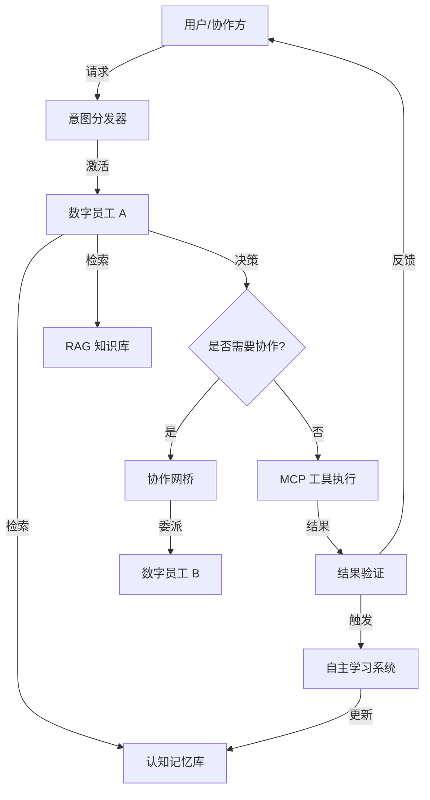

# 🗺️ 数字员工运行机制蓝图 (Digital Employee Operational Blueprint)

> **版本**: 1.0 (Draft)
> **日期**: 2026-01-03
> **状态**: 核心设计阶段

## 1. 引言 (Introduction)
本文档旨在定义 BotMatrix 系统中**数字员工 (Digital Employee)** 的全生命周期运行机制。数字员工不再是孤立的聊天机器人，而是具备身份、记忆、技能、协作能力及 KPI 考核的组织成员。

---

## 2. 核心架构：数字员工的“五感六觉”
为了实现“像真人一样工作”，数字员工的架构被划分为以下核心层级：

| 维度 | 对应组件 | 功能描述 |
| :--- | :--- | :--- |
| **身份 (Identity)** | `IdentityGORM` / `BotID` | 工号、职位、所属部门、企业归属及权限范围。 |
| **感知 (Perception)** | `Intent Dispatcher` | 接收来自 IM (OneBot)、API 或 协作请求的意图。 |
| **思维 (Cognition)** | `AI Service Layer` | 基于 LLM 的推理、规划与决策中心。 |
| **记忆 (Memory)** | `Cognitive Memory` | **短期**: 会话上下文；**长期**: 事实片段、用户偏好、业务知识。 |
| **技能 (Skills)** | `MCP Toolset` | 能够调用的工具（数据库、API、跨企业服务）。 |
| **协作 (Social)** | `Agent Mesh` | 与其他员工（同企业或跨企业）进行任务委派与咨询。 |
| **进化 (Evolution)** | `Auto-Learning` | 从工作中提取知识，自我纠错与能力提升。 |

---

## 3. 运行全生命周期 (The Operational Lifecycle)

### 3.1 意图激活 (Triggering)
任务可以通过三种方式进入数字员工的工作流：
1.  **直接指令**: 用户通过 IM（如企业微信、飞书）直接下达任务。
2.  **协作委派**: 另一名数字员工通过 `task_delegate` 工具将子任务委派给该员工。
3.  **定时调度**: 系统预设的 Cron 任务触发（如：每日早报生成）。

### 3.2 认知处理循环 (The Cognitive Loop)
当任务激活后，数字员工进入以下循环：
1.  **环境感知 (Context Loading)**:
    *   加载当前会话的 `Short-term Memory`。
    *   根据意图，从 `Long-term Memory` 检索相关事实。
    *   检索 RAG 知识库，获取业务背景。
2.  **任务规划 (Planning)**:
    *   LLM 分析任务，决定是否需要拆解任务。
    *   如果任务复杂，生成多步执行计划。
3.  **工具调用 (Execution)**:
    *   通过 MCP 协议调用本地或远程工具。
    *   **协作分支**: 如果自身能力不足，调用 `colleague_consult` 咨询同事。
4.  **结果验证 (Validation)**:
    *   检查工具输出是否符合预期。

### 3.3 任务交付与闭环 (Closing & Learning)
1.  **结果反馈**: 向发起方返回最终结果或 `execution_id`（针对异步任务）。
2.  **记忆固化**: 对话结束后，后台触发 `ExtractAndSaveMemories`，将新学到的事实存入 `CognitiveMemoryGORM`。
3.  **KPI 生成**: 系统自动评估响应速度、准确率及 Token 消耗，记录至 `DigitalEmployeeKpiGORM`。

---

## 4. 协作机制：数字员工网格 (Agent Mesh)

数字员工的强大在于“团队作战”。

### 4.1 企业内协作 (Intra-Enterprise)
*   **同步咨询**: 类似“打电话”，Agent A 询问 Agent B 一个具体问题，B 立即回复。
*   **异步委派**: 类似“发邮件”，Agent A 将任务交给 Agent B，A 继续处理其他事情，B 完成后通过 `task_report` 汇报。

### 4.2 跨企业协作 (Inter-Enterprise / B2B)
*   **身份映射**: 企业 B 的员工在企业 A 中表现为“访客身份”，受 A 企业权限系统管控。
*   **共享技能**: A 企业可以将特定的 MCP 工具（如：库存查询）授权给 B 企业的特定数字员工使用。

### 4.3 协作协议标准 (Collaboration Protocol)

为了确保不同类型的数字员工能够高效对话，系统定义了统一的 **Agent-to-Agent (A2A) 消息格式**：

```json
{
  "header": {
    "msg_id": "uuid-v4",
    "parent_msg_id": "uuid-v4",
    "execution_id": "exec-123",
    "sender": { "id": "emp-001", "type": "digital_employee" },
    "receiver": { "id": "emp-002", "type": "digital_employee" },
    "priority": "high"
  },
  "payload": {
    "intent": "TASK_DELEGATE",
    "content": {
      "task_title": "分析 Q4 财报异常",
      "parameters": { "threshold": 0.05 },
      "context_summary": "发现营收增长与现金流不匹配..."
    }
  },
  "control": {
    "require_approval": false,
    "timeout_ms": 30000
  }
}
```

---

## 5. 绩效评价引擎 (KPI Evaluation Engine)

数字员工的价值必须是可量化的。系统通过以下维度进行自动与半自动评分：

### 5.1 量化指标 (Quantitative Metrics)
*   **处理成功率 (Task Success Rate)**: 成功完成的任务数 / 总分派任务数。
*   **平均响应耗时 (Avg Response Time)**: 从任务分派到首次响应的平均时间。
*   **Token 转化率 (Token Efficiency)**: 完成单位任务消耗的虚拟薪资成本。

### 5.2 质化指标 (Qualitative Metrics)
*   **用户满意度 (User Satisfaction)**: 来自人类用户的打分（1-5星）。
*   **合规性评分 (Compliance Score)**: AI 自动审计其操作是否符合企业安全策略。
*   **协作贡献度 (Collaboration Score)**: 被其他员工“咨询”或“委派”的频率。

---

## 6. 人工干预机制 (Human-in-the-loop - HITL)

数字员工并非万能，在以下关键时刻必须引入人类智慧：

1.  **低置信度拦截**: 当 LLM 对任务理解的置信度低于阈值（如 0.6）时，自动挂起任务并向主管推送通知。
2.  **高风险操作确认**: 涉及大额支付、系统配置变更或跨企业敏感数据共享时，必须由人类管理员在 App 端点击“核准”。
3.  **知识盲区求助**: 数字员工可以主动发出 `HELP_REQUEST` 信号，由人类导师通过对话框直接接管，接管过程将被记录并用于后续的“自我进化”。

---

## 7. 行业与岗位适应性规划 (Industry & Role Adaptability)

为了适应不同规模的企业（从初创公司到规模化集团）以及各种岗位需求，系统提供**岗位标准模板库 (Role Template Library)**。

### 7.1 标准岗位模板 (Standard Role Templates)

| 岗位类别 | 核心能力 (MCP Tools) | 核心KPI指标 | 典型应用场景 |
| :--- | :--- | :--- | :--- |
| **行政助理** | 日程管理、会议预订、差旅审批 | 响应时间、任务完成率 | 自动安排会议、处理报销流程。 |
| **技术支持** | 日志分析、代码检索、知识库查询 | 问题解决率、用户满意度 | 7x24h 自动排障、辅助代码 Review。 |
| **财务初审** | 发票识别、账单核对、ERP 接口 | 准确率、合规性 | 自动化发票报销预审、异常账单预警。 |
| **数字前台** | 访客登记、意图分流、常见问题解答 | 分流准确率、接待量 | 自动接待多渠道咨询并分派给专业员工。 |
| **数据分析师** | SQL 查询、报表生成、趋势预测 | 数据洞察深度、报表时效性 | 每日自动生成经营日报、预测库存波动。 |

### 7.2 多租户与数据隔离 (Multi-tenancy & Isolation)

系统通过以下层级确保数据安全：

*   **租户隔离 (Tenant Isolation)**: 不同企业的数据存储在独立的 Schema 或通过 `EnterpriseID` 物理隔离。
*   **部门隔离 (Department Isolation)**: 即使在同一企业内，敏感部门（如财务、人力资源）的知识库和记忆也支持按部门加密存储，仅限授权员工访问。
*   **跨企业访问网关 (B2B Gateway)**: 所有跨企业协作必须经过 B2B 网关的协议转换和权限校验，严禁直接访问对方底层数据库。

---

## 8. 合规与安全体系 (Compliance & Security)

数字员工的操作必须受到严格监控和限制。

1.  **数据脱敏 (Data Masking)**: 在发送数据给公有云 LLM 之前，自动识别并脱敏敏感信息（姓名、手机号、账号等）。
2.  **操作审计 (Audit Trail)**: `AIAgentTrace` 记录每一次工具调用的参数、返回结果及其对应的 `execution_id`。
3.  **权限最小化 (Least Privilege)**: 数字员工仅拥有完成其职位任务所需的最小 MCP 工具调用权限。
4.  **道德边界 (Ethics Guardrail)**: 内置合规性检查层，拒绝处理违反企业文化或法律法规的请求。

---

## 7. 待办事项与任务管理 (Task & Todo Management)

每个数字员工拥有自己的 **待办事项列表 (DigitalEmployeeTodo)**，用于管理其正在处理和待处理的任务。

*   **来源**: 系统自动根据委派任务创建，或由管理者手动添加。
*   **状态追踪**: `pending` -> `in_progress` -> `completed` / `failed`。
*   **优先级**: 根据任务紧急程度自动排序。

---

## 6. 数据流向图 (Data Flow)



---

## 7. 下一步规划 (Next Steps)

1.  **模型优化**: 完善 `Identity` 模型，增加部门、职级及权限树字段。
2.  **任务引擎**: 开发统一的任务调度与追踪引擎，支持 `execution_id` 的全链路回溯。
3.  **KPI 仪表盘**: 实现可视化的数字员工绩效分析界面。
4.  **冲突处理**: 强化自主学习中的知识冲突消解逻辑。
