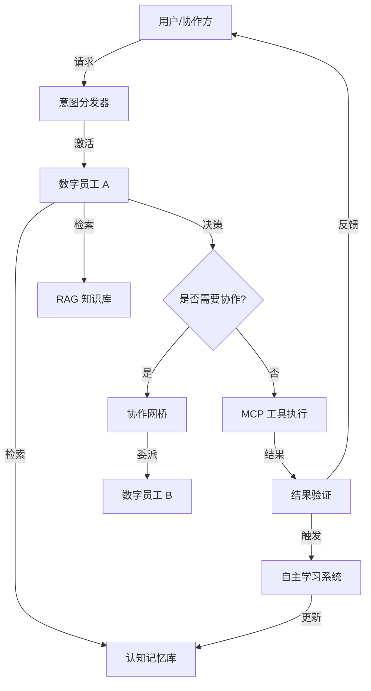

# 👔 数字员工系统 (Digital Employee System)

> **版本**: 1.0
> **状态**: 核心架构已实现
> [🌐 English](../en-US/DIGITAL_EMPLOYEE_SYSTEM.md) | [简体中文](DIGITAL_EMPLOYEE_SYSTEM.md)
> [⬅️ 返回文档中心](README.md) | [🏠 返回项目主页](../../README.md)

## 1. 概念定义
**数字员工 (Digital Employee)** 是 BotMatrix 对 AI 机器人的高级拟人化封装。它不再仅仅是一个执行代码的“机器人实例”，而是一个拥有**工号、职位、部门、人设、技能集以及 KPI 考核**的虚拟雇员，能够像真人一样参与企业业务流程。

---

## 2. 核心架构：“五感六觉”
为了实现“像真人一样工作”，数字员工的架构被划分为以下核心层级：

| 维度 | 对应组件 | 功能描述 |
| :--- | :--- | :--- |
| **身份 (Identity)** | `IdentityGORM` / `BotID` | 工号、职位、所属部门、企业归属及权限范围。 |
| **感知 (Perception)** | `Intent Dispatcher` | 接收来自 IM (OneBot)、API 或协作请求的意图。 |
| **思维 (Cognition)** | `AI Service Layer` | 基于 LLM 的推理、规划与决策中心。 |
| **记忆 (Memory)** | `Cognitive Memory` | **短期**: 会话上下文；**长期**: 事实片段、用户偏好、业务知识。 |
| **技能 (Skills)** | `MCP Toolset` | 能够调用的工具（数据库、API、跨企业服务）。 |
| **协作 (Social)** | `Agent Mesh` | 与其他员工（同企业或跨企业）进行任务委派与咨询。 |
| **进化 (Evolution)** | `Auto-Learning` | 从工作中提取知识，自我纠错与能力提升。 |

---

## 3. 运行全生命周期 (Operational Lifecycle)

### 3.1 意图激活 (Triggering)
任务可以通过三种方式进入数字员工的工作流：
1. **直接指令**: 用户通过 IM（如企业微信、飞书、钉钉）直接下达任务。
2. **协作委派**: 另一名数字员工通过 `task_delegate` 工具将子任务委派给该员工。
3. **定时调度**: 系统预设的 Cron 任务触发（如：每日早报生成、系统巡检）。

### 3.2 认知处理循环 (Cognitive Loop)
1. **环境感知 (Context Loading)**: 加载短期记忆、检索长期事实、获取 RAG 业务背景。
2. **任务规划 (Planning)**: LLM 分析任务，决定是否拆解为多步执行计划。
3. **工具调用 (Execution)**: 通过 MCP 协议调用工具。能力不足时调用 `colleague_consult` 咨询同事。
4. **结果验证 (Validation)**: 检查输出是否符合预期。

### 3.3 交付与闭环 (Closing & Learning)
1. **结果反馈**: 返回最终结果或 `execution_id`。
2. **记忆固化**: 后台自动提取关键事实并存入 `CognitiveMemoryGORM`。
3. **KPI 生成**: 自动评估性能指标并记录。

---

## 4. 协作机制：数字员工网格 (Agent Mesh)

### 4.1 企业内与跨企业协作
- **同步咨询**: 实时问答（类似电话）。
- **异步委派**: 任务指派与结果汇报（类似邮件）。
- **跨域授权**: 使用双向 JWT 握手。企业 B 的员工在企业 A 中表现为受控的“访客身份”。

### 4.2 A2A 协作协议标准
```json
{
  "header": {
    "msg_id": "uuid-v4",
    "execution_id": "exec-123",
    "sender": { "id": "emp-001", "type": "digital_employee" },
    "receiver": { "id": "emp-002", "type": "digital_employee" }
  },
  "payload": {
    "intent": "TASK_DELEGATE",
    "content": {
      "task_title": "分析 Q4 财报异常",
      "parameters": { "threshold": 0.05 }
    }
  },
  "control": { "require_approval": false, "timeout_ms": 30000 }
}
```

---

## 5. KPI 考核与进化体系

### 5.1 核心考核维度
系统根据任务执行结果自动计算绩效：

| 维度 | 计算逻辑 | 权重 |
| :--- | :--- | :--- |
| **完成率 (Success Rate)** | `成功任务数 / 总任务数` | 40% |
| **执行效率 (Efficiency)** | `平均步骤耗时 vs 模板基准耗时` | 30% |
| **自主度 (Autonomy)** | `无人工干预执行数 / 总任务数` | 20% |
| **成本 (Cost)** | `消耗 Token 数 vs 任务价值系数` | 10% |

### 5.2 自动进化与优化
KPI 分数影响资源分配。低绩效员工触发“再培训”：
1. 系统分析最近失败的任务。
2. AI 自动生成更精准的 `Bio` (人设) 或提示词补丁以提升成功率。

---

## 6. 任务待办与管理 (Todo System)

### 6.1 任务状态
每个数字员工拥有独立的任务队列：
- **待处理 (Pending)**: 已指派但尚未开始。
- **执行中 (Executing)**: 正在由 AI 引擎驱动。
- **需审批 (Pending Approval)**: 等待人工介入的高风险任务。

### 6.2 管理接口 (Admin API)
- `GET /api/admin/employees/tasks`: 获取员工任务列表。
- `GET /api/admin/employees/kpi`: 获取绩效统计数据。
- `POST /api/admin/employees/optimize`: 触发 AI 驱动的自动优化。

---

## 7. 安全、合规与人工干预 (HITL)

### 7.1 人工干预时刻
1. **低置信度拦截**: LLM 置信度低于阈值时自动挂起。
2. **高风险操作**: 大额支付、配置变更需人类管理员点击“核准”。
3. **知识盲区**: 数字员工可发出 `HELP_REQUEST` 由人类接管。

### 7.2 安全保障
- **数据脱敏**: 上传 LLM 前自动识别并屏蔽敏感信息。
- **审计跟踪**: `AIAgentTrace` 记录每一次工具调用的全量参数与返回。
- **权限最小化**: 仅授权岗位所需的最小 MCP 工具集。

---

## 8. 岗位标准模板库 (Role Templates)

| 岗位类别 | 核心能力 (MCP Tools) | 典型应用场景 |
| :--- | :--- | :--- |
| **行政助理** | 日程管理、差旅审批 | 自动安排会议、处理报销。 |
| **技术支持** | 日志分析、代码检索 | 7x24h 自动排障、辅助 Code Review。 |
| **财务初审** | 发票识别、ERP 接口 | 自动化报销预审、异常账单预警。 |
| **数据分析师** | SQL 查询、报表生成 | 自动生成经营日报、预测趋势。 |

---

## 9. 数据流向图

