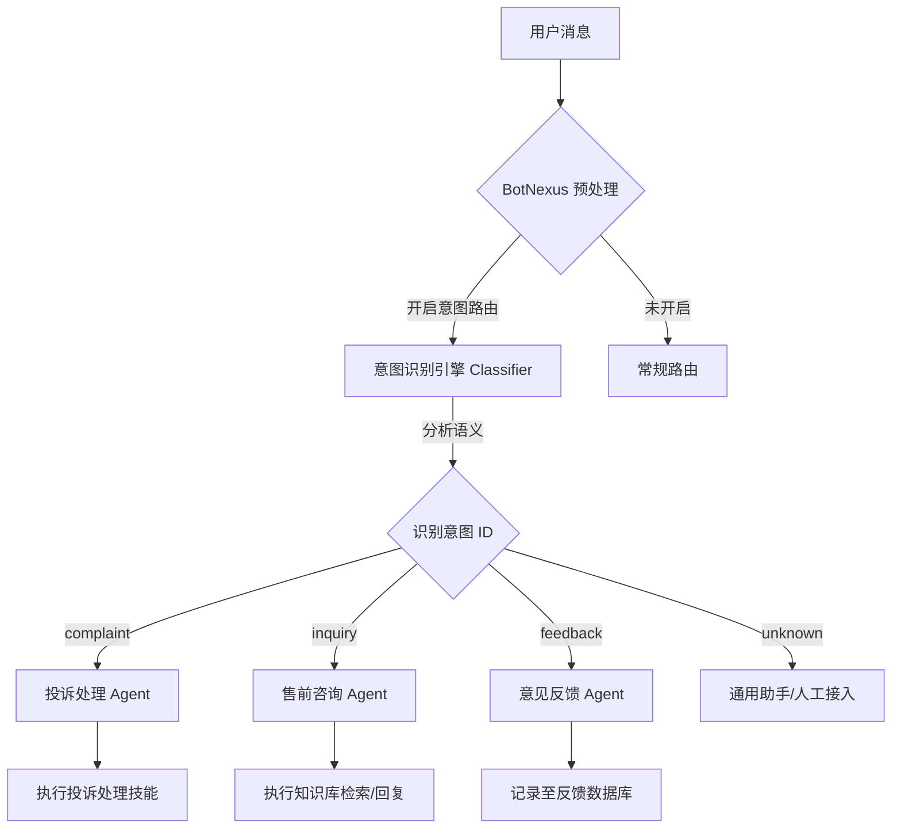

# 智能意图分发系统 (Intelligent Intent Dispatch System)

> [⬅️ 返回文档中心](README.md) | [🏠 返回项目主页](../../README.md)

## 1. 系统背景
在复杂的群聊环境中，用户发送的消息可能包含多种意图（如：投诉、咨询、闲聊、报错）。传统的关键词匹配难以精准识别语义，而让每一个机器人（技能）都去处理所有消息又会造成极大的 Token 浪费和响应混乱。

**智能意图分发系统** 充当了系统的“分诊台”，它在消息进入核心逻辑之前，先通过轻量级 AI 模型识别用户意图，并根据预设规则将消息路由到最合适的技能机器人。

## 2. 双层调度架构 (Two-Level Scheduling)

系统将调度逻辑分为两个完全不同的层面，以适应复杂的业务场景。

### 2.1 第一层：系统级调度 (System-Level)
*   **主体**: BotNexus 核心引擎。
*   **目标**: 资源分配与技能分发。
*   **逻辑**: 当消息进入系统后，Nexus 决定由哪个 **Worker** 或哪个 **AI 技能 (Skill)** 来处理。
*   **场景**: “这条消息应该由 Python 处理还是 Go 处理？”、“这条消息应该调用 GPT-4 还是 DeepSeek？”

### 2.2 第二层：用户侧群组调度 (User-Level / Group Collaboration)
*   **主体**: 用户群聊中的“机器人集群”。
*   **目标**: 角色分工与多机协作。
*   **逻辑**: 在同一个群组中，用户可能部署了多个机器人（如：A 机器人负责群管，B 机器人负责财务，C 机器人负责技术咨询）。
*   **场景**: “用户在群里问了一个技术问题，群管机器人 A 识别意图后，@技术机器人 C 进行回答。”

---

## 3. 核心架构图

## 3. 工作流程 (Workflow)

1.  **消息捕获**: BotNexus 接收到群聊或私聊消息。
2.  **意图判定**:
    *   系统调用 `AIIntentGORM` 中定义的激活意图列表。
    *   构造特定的 `System Prompt`，引导模型返回结构化的意图 Code（如 `{"intent": "complaint"}`）。
3.  **路由查找**:
    *   根据识别出的 `IntentID`，在 `AIIntentRoutingGORM` 表中查找对应的 `TargetID`。
    *   `TargetType` 可以是 `skill`（执行 AI 技能）、`worker`（转发给特定后端）或 `plugin`（触发传统插件）。
4.  **任务分发**:
    *   如果目标是 `skill`，则加载对应的 `AISkillGORM` 配置（含专属 Prompt）进行推理。
    *   如果目标是 `worker`，则通过 Redis 将消息推送到指定的 Worker 节点。

## 4. 关键优势
- **精准度高**: 基于语义理解而非简单的正则匹配。
- **成本控制**: 先分流，后处理。只有高价值意图才调用复杂的长文本模型。
- **灵活配置**: 管理员可以在 WebUI 动态添加新意图（如：新增“活动报名”意图），并绑定处理脚本。
- **多智能体协作**: 实现了从“单体机器人”向“多 Agent 协作系统”的进化。

## 5. 数据模型支持
- **`ai_intents`**: 定义意图及其判定标准。
- **`ai_intent_routings`**: 定义意图与技能/执行节点的映射关系。
- **`ai_prompt_templates`**: 存储意图识别专用的提示词模板。
