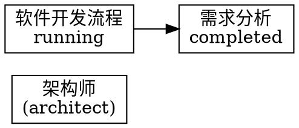
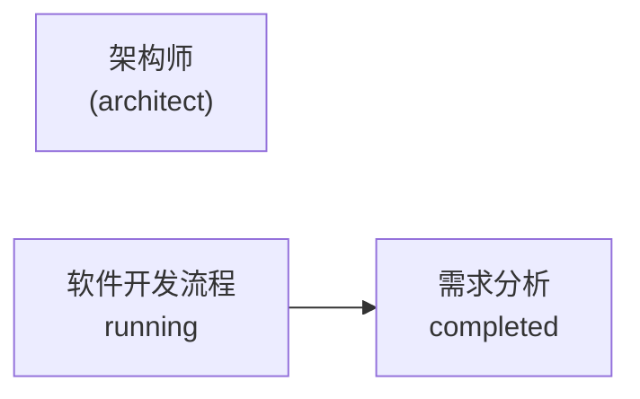

# 通用协作架构

## 概述

通用协作架构是一个用于数字员工协作的通用框架，支持各种类型的数字员工之间的沟通、任务分配和工作流管理。

## 核心组件

### 1. 消息总线 (MessageBus)

实现数字员工之间的消息传递机制，支持点对点消息和广播消息。

### 2. 任务分配器 (TaskAssigner)

根据角色技能和工作负载，智能分配任务给最合适的数字员工。

### 3. 动态角色加载器 (DynamicRoleLoader)

支持在运行时加载新的角色类型，实现角色的动态扩展。

### 4. 工作流管理器 (WorkflowManager)

管理数字员工之间的协作流程，支持复杂的工作流定义和执行。

### 5. 可视化 (Visualization)

提供协作数据的可视化展示，支持JSON、Graphviz和Mermaid格式导出。

## 接口定义

### Role 接口

```go
type Role interface {
    GetID() string
    GetName() string
    GetType() string
    GetSkills() []string
    ExecuteTask(task Task) (Result, error)
    LearnSkill(skill string) error
    GetStatus() RoleStatus
    SetStatus(status RoleStatus) error
}
```

### Collaborator 接口

```go
type Collaborator interface {
    GetCollaborationID() string
    GetCollaborationType() string
    InitiateCollaboration(targetRoleID string, request CollaborationRequest) error
    RespondToCollaboration(requestID string, response CollaborationResponse) error
    CancelCollaboration(requestID string) error
    GetCollaborationStatus(requestID string) (CollaborationStatus, error)
}
```

### MessageBus 接口

```go
type MessageBus interface {
    SendMessage(message Message) error
    Subscribe(roleID string, handler MessageHandler) error
    Unsubscribe(roleID string, handler MessageHandler) error
    Broadcast(message Message) error
    SendDelayedMessage(message Message, delay time.Duration) error
}
```

## 使用示例

```go
// 创建消息总线
messageBus := NewMessageBus()

// 创建工作流管理器
workflowManager := NewWorkflowManager(messageBus)

// 创建任务分配器
taskAssigner := NewTaskAssigner(messageBus)

// 创建动态角色加载器
dynamicRoleLoader := NewDynamicRoleLoader(messageBus)

// 创建可视化
visualization := NewVisualization(messageBus, workflowManager)

// 注册角色工厂
// dynamicRoleLoader.RegisterRoleFactory(NewDevelopmentTeamRoleFactory())

// 加载角色配置
// dynamicRoleLoader.LoadRolesFromDirectory("config/roles")

// 创建工作流
steps := []*WorkflowStep{
    {
        ID:          "step_1",
        Name:        "需求分析",
        Description: "分析项目需求",
        Type:        WorkflowStepTypeTask,
        RoleType:    "architect",
    },
    // ... 更多步骤
}

workflow, err := workflowManager.CreateWorkflow("软件开发流程", "完整的软件开发工作流", steps)
if err != nil {
    log.Printf("Failed to create workflow: %v", err)
    return
}

// 启动工作流
workflowManager.StartWorkflow(workflow.ID)
```

## 扩展性

### 角色扩展

通过实现RoleFactory接口，可以扩展新的角色类型：

```go
type MyRoleFactory struct {}

func (f *MyRoleFactory) CreateRole(config RoleConfig) (Role, error) {
    // 创建自定义角色实例
    return &MyRole{
        ID:      config.ID,
        Name:    config.Name,
        Type:    config.Type,
        Skills:  config.Skills,
    }, nil
}

func (f *MyRoleFactory) GetSupportedRoleType() string {
    return "my_role"
}
```

### 工作流扩展

通过定义新的WorkflowStepType，可以扩展工作流步骤类型：

```go
const (
    WorkflowStepTypeMyCustomType WorkflowStepType = "my_custom_type"
)
```

## 可视化导出

### JSON格式

```json
{
    "timestamp": "2024-01-01T00:00:00Z",
    "workflows": [
        {
            "id": "workflow_1",
            "name": "软件开发流程",
            "status": "running",
            "steps": [
                {
                    "id": "step_1",
                    "name": "需求分析",
                    "status": "completed",
                    "role_type": "architect"
                }
            ]
        }
    ],
    "roles": [
        {
            "id": "role_1",
            "name": "架构师",
            "type": "architect",
            "status": "idle",
            "skills": ["需求分析", "系统设计"],
            "task_count": 0
        }
    ]
}
```

### Graphviz格式



### Mermaid格式



## 未来规划

- 支持更多的可视化格式
- 实现实时协作监控
- 集成AI优化协作流程
- 支持分布式协作
